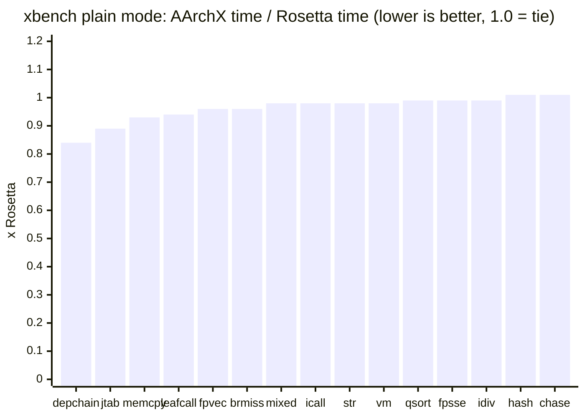

<p align="center">
  
</p>

<h1 align="center"><em>AArchX</em></h1>

<p align="center">
  <b>A from-scratch x86-64 to arm64 userspace binary translator for macOS.</b><br>
  <sub>No Rosetta translation at runtime.</sub><br>
  <sub>Previously called Ocerz. The binary, the source tree and the environment variables still carry that name.</sub>
</p>

<p align="center">
  
  
  
  
</p>

> [!WARNING]
> AArchX is experimental. Do not use it for production workloads.

AArchX loads and runs x86-64 Mach-O programs on Apple Silicon with its own decoder, interpreter, JIT, dynamic linker and syscall layer. It also runs i386 PE code inside Wine's WoW64 process.

The Rosetta package still has to be installed, because it is what ships the x86-64 shared cache. AArchX maps that cache itself and never calls Rosetta's translator.

## Build and run

```sh
make -j
./ocerz version
./ocerz tests/guest/bin/hello
./ocerz /Applications/SomeApp.app/Contents/MacOS/SomeApp
```

`make check` builds the unit and guest tests and runs every gate: the guest suite under the interpreter and under the JIT, the x86-64 differential gate (each guest binary under `-no-jit` and under the JIT must match byte for byte), the i386 differential gate and the dynamic-linking tests. The i386 gate needs the Python `capstone` package.

## Status

| Area | Current result |
| --- | --- |
| arm64 emitter | encodings validated by execution |
| instruction corpus | 511 instructions |
| x86-64 decode | 199 / 199 cases |
| i386 decode | 102 cases, 26 rejects, 122 address cases |
| extension / SSE suites | 233 / 0, 246 / 0, SSE4.2 differential against Rosetta |
| loader / syscall suites | 54 / 0, 324 / 0 |
| memory / shared mappings | 2692 / 0, 91 / 0 |
| i386 interpreter / JIT / WoW64 | passing |
| x86-64 guest gate | 93 / 93 |
| x86-64 differential gate (interpreter vs JIT) | 84 / 84 |
| i386 differential gate | 20,033 / 20,033 |
| dynamic-mode tests | 47 / 47 |
| real macOS apps opening their main window | 9 (see [Application compatibility](#application-compatibility)) |
| xbench output vs native | 15 / 15 kernels bit-identical |
| xbench speed vs Rosetta | 13 wins, 2 ties (table below) |
| Wine boot (MacNdCheese build, `cmd /c ver`) | 14 s |

What is in the box:

- Mach-O loader, x86 decoder, interpreter, arm64 JIT, mini-dyld and syscall layer, all written for this project.
- Live `dyld_shared_cache_x86_64` mapping with fixups, initializers, Objective-C registration and `dlopen`/`dlsym`.
- Native guest threads, libdispatch workqueue bridging, Mach messages, signals and x86-TSO memory ordering.
- JIT cache invalidation on guest code writes and executable mapping changes.
- Differential tests for both x86-64 and i386 execution.

## Application compatibility

Confirmed on 2026-09-11 on an Apple silicon MacBook Air with macOS 26.6.
Each app's x86-64 slice was launched straight from its bundle, for example
`./ocerz /System/Applications/Chess.app/Contents/MacOS/Chess`. Here "works"
means the app drew its main window on screen and stayed up.

| Application | Result under AArchX |
| --- | --- |
| Chess | works and plays: board window, and the `sjeng` engine subprocess answers moves |
| Calculator | works (window on screen) |
| Dictionary | works (window on screen) |
| Font Book | works (window on screen) |
| Grapher | works (window on screen) |
| Digital Color Meter | works (window on screen) |
| Activity Monitor | window on screen; its force-quit support library is not in the x86-64 shared cache |
| Console | window on screen; logs a missing optional library |
| TextEdit / Preview / Script Editor | run; open a document window when given a file to open |
| Steam (x86-64 client) | works with `-cef-disable-gpu` (2026-09-12): bootstrapper, `ipcserver`, client and the CEF web helper with GPU, utility and renderer processes; the window draws with software rendering. Some launches still stall before the web UI starts. See [Steam](#steam). |

Command-line tools match their native output byte for byte
(`tools/apptest.sh cli`, 16 of 16): `uname`, `sw_vers`, `echo`, `ls`, `id`,
`basename`, `wc`, `sort`, `uniq`, `head`, `grep`, `file`, `xxd`, `nm`,
`plutil` and `openssl` (`version` and `dgst -sha256`).

Not working yet:
- **Safari** starts but never shows a window. JavaScriptCore's `thread_suspend` reaches the host kernel and freezes a thread that holds the JIT lock.
- **Photos** aborts in `+[PAOpenGLDevice _sharedPixelFormat:]`: `CGLChoosePixelFormat` returns 10002 for every attribute set. Root cause: `IOServiceGetMatchingServices("IOAccelerator")` yields the `AppleMetalGLRenderer` compatibility service only to genuinely Rosetta-translated x86 processes — a native arm64 process and ocerz both see only the one hardware accelerator, and CGL needs that compat renderer to build a pixel format. Metal itself works under ocerz (real device, identical feature sets); the gap is the Rosetta-only GL compatibility renderer, which would have to be synthesized in the IOKit layer.

## Steam

The x86-64 macOS Steam client comes up with its full UI under AArchX, confirmed 2026-09-12: the bootstrapper, `ipcserver`, the client and the CEF web helper with its GPU, utility and renderer processes, all translated, with the Steam window on screen. After its first update the client lives in Application Support, and CEF has to run without GPU acceleration:

```sh
./ocerz "$HOME/Library/Application Support/Steam/Steam.AppBundle/Steam/Contents/MacOS/steam_osx" -cef-disable-gpu
```

Getting the client this far took SysV semaphores for Steam's tier0 threading, an absolute executable path (Steam derives its bundle root from it), `dlopen` of the executable returning the already loaded main image, C++ initializers run in dependency order, and a 96 GB guest arena, because Chromium's PartitionAlloc reserves a 32 GB region at startup.

`steam_osx` starts `ipcserver` with `launchctl load -S Background` on a plist it writes into Application Support, which would have launchd run it natively. AArchX rewrites that plist on the way through, putting itself in front of `ProgramArguments` and in `Program` (Steam's own plist only has `Program`, so the array is built from it), and enables the job's label first: a legacy `launchctl unload` leaves the label disabled, and every load after that fails with an I/O error while the client reports `ipcserver init failed`. The Mach service lookup itself was never the problem, since Mach traps go straight to the host kernel.

CEF's GPU process initializes ANGLE through CGL, which fails for the same reason Photos does: the `AppleMetalGLRenderer` compatibility service is only offered to Rosetta-translated processes. With `-cef-disable-gpu` CEF renders through SwiftShader instead. That works, and it is slower.

The client then waits for the web helper to report ready, polling every 50 ms for 120 s, and gives up on the UI if it does not. Three JIT problems kept the helper from making it:

- Threads blocked on the JIT lock could lose their wakeup and wedge translation for the whole process. The lock is now taken with trylock, yields and short sleeps, and never parks.
- A page invalidated three times was left to the interpreter until it had been quiet for 1.5 s. Hot shared-cache pages in ICU, libdispatch and Foundation never went quiet: one ICU page was refused translation about 30 million times in a two-minute run. A blacklisted page is now also retranslated after 4096 refusals.
- An alignment or commpage fault marks its block and invalidates its 64 KB granule, and the JIT's code index still finds retired blocks. Every other thread still running the retired translation faulted as well, found the block already marked, and invalidated the granule again, discarding the translation that had just been fixed. A fault from a retired translation now simply recovers.

The last two changes took translate refusals from about 25 million to under 64 thousand per run, and the renderer has come up 85 to 151 s after launch. Some launches still stall before the web helper starts its child processes, with the JIT lock held inside translation; relaunching gets past it.

## Wine and i386

Wine 11.8 runs x86-64 and i386 PE applications through AArchX. With a WoW64 prefix, 32-bit Notepad and WineMine load `winemac.drv` and open titled Cocoa windows. They stay up. Until 2026-09-05 every Wine GUI process died about 24 seconds in: a CoreSpotlight category that never attached threw inside a dispatch block, and an IOSurface page the kernel mapped for the process sat at an address the guest could not see. Both are fixed; the first is why CoreSpotlight is in the default Objective-C preload list. The Wine launchers turn on the Objective-C category preload that AppKit needs; the workqueue bridge is on for every process now, because a Cocoa application deadlocks without it.

```sh
WINE="/path/to/Wine Devel.app/Contents/Resources/wine"
export WINEARCH=wow64
export WINEPREFIX="$HOME/.wine-ocerz"

./ocerz "$WINE/bin/wine" wineboot -u
./ocerz "$WINE/bin/wine" notepad
```

MacNdCheese's Wine build runs under AArchX as well, and Steam is the application the Wine work is measured against. Exceptions raised in 32-bit code now reach the 32-bit handler. Until 2026-09-05 the decoder folded `mov r/m, sreg` into the long-mode constants, so the 32-bit `RtlCaptureContext` recorded the 64-bit code selector, WoW64 copied it into the frame it restores with `iretq`, and the 32-bit exception dispatcher ran as 64-bit code until the stack overflowed. Every Steam process died that way within a second of starting, at its first `OutputDebugString`, and Steam relaunched itself in a loop. Selectors are CPU state now, and a far transfer takes the low 16 bits of a selector slot the way the hardware does, because Wine's `I386_CONTEXT` leaves stack garbage above them. A 32-bit program that raises and catches exceptions runs to completion; the guest tests `mov_sreg` and `far_sel_bits` and the i386 differential case `mov-sreg` pin the behavior. Steam's client core starts: the connectivity test passes and CEF runs the login page's JavaScript. SSE4.2 is implemented and advertised because Steam checks for it.

Memory is the next limit: Steam is nineteen emulated processes, and each one used to carry private copies of every file it mapped, because guest pages are 4 KB and host pages 16 KB. A private file mapping whose file offset and guest address agree modulo 16 KB, which is nearly all of them, now maps its aligned interior straight from the file, so PE images and the fonts Wine enumerates live in the shared page cache. That took 200 MB off a WineMine process and a second off the boot. The other big item was the JIT's own bookkeeping: every translated block kept the full 96-byte decode of each of its instructions and a fixed table of eight branch edges, 1.6 KB per block across 215,000 blocks. A published block now keeps a 16-byte reference per instruction, full copies only of the few instructions it still runs through the interpreter or inspects during fault recovery, and exactly the edges it has. A WineMine process went from 1.1 GB to 714 MB of footprint over the two changes, explorer from 860 MB to 611 MB, with the xbench table unchanged. The test watchdog measures the group's physical footprint rather than RSS, since RSS counts the shared cache in every process.

Rosetta runs i386 PE code through Wine WoW64 too, so AArchX's i386 support is replacement parity rather than something new. Standalone i386 Mach-O applications are not supported by current macOS or its SDKs.

## Benchmarks

Ratio is AArchX time divided by Rosetta time; lower is better.

| Kernel | Ratio |
| --- | ---: |
| `depchain` | **0.84x** |
| `jtab` | **0.89x** |
| `memcpy` | **0.93x** |
| `leafcall` | **0.94x** |
| `fpvec` | **0.96x** |
| `brmiss` | **0.96x** |
| `mixed` | **0.98x** |
| `icall` | **0.98x** |
| `str` | **0.98x** |
| `vm` | **0.98x** |
| `qsort` | **0.99x** |
| `fpsse` | **0.99x** |
| `idiv` | **0.99x** |
| `hash` | 1.01x |
| `chase` | 1.01x |



Apple M2 Max, 2026-09-04, `REPS=5`, paired delta `t(n) - t(n/2)`, byte-identical output. Reproduce with `python3 tests/xbench_compare.py`. `hash` and `chase` are ties that no translation can move: `hash` is a chain of multiply, shift and or per step and both sides are bound by multiply latency; `chase` is a dependent-load chain and both sides wait on the cache. Anything within a couple of percent of 1.00x flips from run to run, and a busy machine moves every ratio by that much.

`mixed` was a 1.20x loss for a long time, and the whole gap was the price of bit-exact x86 NaN semantics: every packed FP result needed a check before anything could use it. The JIT now defers that check to the compares that read the value, and Rosetta-style hot paths that the compiler split with rare-case branches get retranslated with the hot side inline. Both are exact; the NaN tests in `tests/guest` compare bit patterns against the native binary.

These kernels never create a thread, fork or map shared memory, so they run in plain memory mode throughout. A program that does any of those retires plain mode for good (`ocerz_jit_require_ordered`) and pays for x86-TSO ordering on every scalar load and store; Wine is always in that mode. Under `OCERZ_NO_PLAIN_MEM=1` the same table reads 1.35x on `memcpy`, 0.99x on `fpvec`, 1.08x on `str`, 1.13x on `chase` and stays at parity elsewhere. Scalar accesses use acquire and release forms (flags, locks and atomics are scalar, and a release store orders every earlier vector store); SSE loads and stores are left plain, the default FEX ships too, because ordering them cost 3.3x on `memcpy` and 3.0x on `fpvec`. `OCERZ_TSO_VECTOR=1` orders them as well.

Leaving SSE accesses plain is what moved the two kernels that real applications lean on. In ordered memory mode `memcpy` went from 3.55x to 1.35x of Rosetta and `fpvec` from 3.67x to 0.99x, with `str` and `chase` unchanged and everything else at parity.

```mermaid
xychart-beta
    title "Ordered memory mode vs Rosetta: before and after (x time, lower is better)"
    x-axis [memcpy, fpvec]
    y-axis "x Rosetta" 0 --> 4
    bar [3.55, 3.67]
    bar [1.35, 0.99]
```



The tall bars are the previous ordered-mode cost, the short bars the current one; the dark line at 1.0 would be Rosetta's speed.

## CLI

```text
usage: ocerz [-v] [-trace] [-strace] [-no-jit] [-path file] [--] program [args...]
       ocerz version
```

| Option | Effect |
| --- | --- |
| `-v` | more logging |
| `-trace` | trace guest instructions |
| `-strace` | trace guest syscalls |
| `-no-jit` | interpret this process only |
| `-path file` | load `file` but keep the following guest arguments as they are |
| `--` | end of AArchX options |
| `version` | print the name and version (`AArchX 0.1`) |

| Environment | Effect |
| --- | --- |
| `OCERZ_NOJIT=1` | interpret the whole process tree |
| `OCERZ_NOJIT_EXE=<text>` | interpret processes whose command line matches |
| `OCERZ_NO_HOSTWQ=1` | turn the host workqueue bridge off (it is on by default; `OCERZ_HOSTWQ=1` is still accepted and still means on) |
| `OCERZ_NO_LOADMAP=1` | do not drive a cache image's objc `map_images` before its `+load` runs (it is on by default; the map precedes load as native dyld does, so a framework pulled up only as a transitive dependency does not reach `+load` with un-mapped classes) |
| `OCERZ_NO_UNSTICK=1` | never EINTR a guest thread out of a long wait (the unstick monitor otherwise kicks psynch, semwait, kevent, workq, ulock and Mach waits parked over 800 ms) |
| `OCERZ_NO_THREADACT=1` | hand `thread_suspend`/`thread_resume`/`thread_get_state` on guest threads to the host kernel instead of emulating them (the kernel stops a thread anywhere, even holding the JIT lock, and cannot report x86 registers) |
| `OCERZ_UNSTICK_ALL=1` | let the unstick monitor kick every blocking call, `read`/`recvmsg`/`poll` included, as it used to; apps that do not expect EINTR there fail |
| `OCERZ_NO_PLAIN_MEM=1` | ordered memory forms from the start |
| `OCERZ_TSO_STRICT=1` | order stack-relative accesses too |
| `OCERZ_TSO_VECTOR=1` | order SSE loads and stores too |
| `OCERZ_PRELOAD_OBJC=<paths>` | preload matching shared-cache Objective-C images so their categories attach; `@cat` preloads every image that defines categories (3-4 s more per boot) |
| `OCERZ_NO_VMMAP_STEER=1` | let `mach_vm_map` place mappings anywhere in host space instead of at guest-visible addresses |
| `OCERZ_EXCLOG=1` | print every Objective-C and C++ exception thrown, with the throw site |
| `OCERZ_WILDLOG=1` | report indirect branches whose target lies outside the guest address space, with the source instruction and registers |
| `OCERZ_MODELOG=1` | print every far transfer with its selector, target mode and target address (the WoW64 32/64 switches) |
| `OCERZ_NO_FILEMAP=1` | read every private file mapping into anonymous memory instead of mapping its 16 KB-aligned interior from the file |
| `OCERZ_NO_COMPACT=1` | keep every block's full decoded instruction array after translation |
| `OCERZ_STRICT_SYSCALL=1` | abort on an unimplemented syscall instead of returning `ENOSYS` |
| `OCERZ_NO_FLIP=1` | no profile-driven retranslation of superblocks |
| `OCERZ_NO_FPB_DEFER=1` | check every FP batch immediately instead of at its consumers |
| `OCERZ_NO_MOVFUSE=1` | no folding of `mov` into a following shift |
| `OCERZ_REFAULT_INVAL=1` | invalidate again on every repeat alignment or commpage fault, including faults from retired translations (the old behaviour) |
| `OCERZ_IPCLOG=1` | send the translated `ipcserver`'s output to `/tmp/ocerz_ipcserver.err` |
| `OCERZ_JITLOCKLOG=1` | report JIT lock waits over 3 s with the holder's thread, acquire site, guest `rip` and kernel thread state |
| `OCERZ_BLACKLOG=1` | print the pages most often refused translation because they churned |
| `OCERZ_INVSRC=1` | attribute each churn strike to the code that invalidated the page, as an offset from `ocerz_jit_step` |
| `OCERZ_XLATPAGES=1` | log each distinct 4 KB page a process translates |

## Architecture

| Component | Source | Responsibility |
| --- | --- | --- |
| Loader | `src/loader.c` | Mach-O parsing, mappings, initial stack |
| Decoder | `src/decode.c` | x86-64/i386 to the 411-operation internal IR |
| Interpreter | `src/interp*.c`, `src/flags.c` | reference execution and x86 flag semantics |
| JIT | `src/jit.c`, `src/a64emit.c` | arm64 code generation, block chaining, superblocks |
| Mini-dyld | `src/dyld.c`, `src/cache.c`, `src/dyldapi.c` | shared cache, symbols, fixups, Objective-C |
| Syscalls | `src/syscall.c` | BSD, Mach, signals, threads and WoW64 host calls |

## Limitations

- Application compatibility is incomplete; unsupported syscalls and framework behavior remain.
- Late-loaded shared-cache Objective-C images are not fully registered in general. Wine uses a targeted preload.
- x87 uses 64-bit doubles rather than 80-bit extended precision.
- The approximate `RCP`/`RSQRT` results are not implemented. (SSE rounding modes are: the guest's MXCSR rounding control drives the host FP rounding.)
- Guest protection changes are resolved on the host's 16 KB page boundaries.

## License

[AArchX Proprietary License](LICENSE). Source-available, not open source: anyone may run it, build it from source and patch it for their own personal, educational, academic or research use, free of charge, with the notices kept. Forking on GitHub to read the code or send changes back is fine. Nobody, individual or company, may bundle it into other software, ship a modified version, or turn a copy into their own version, and companies may not use it at all without written permission. Commits before the license change remain available under the LGPL-2.1 they were published with.
