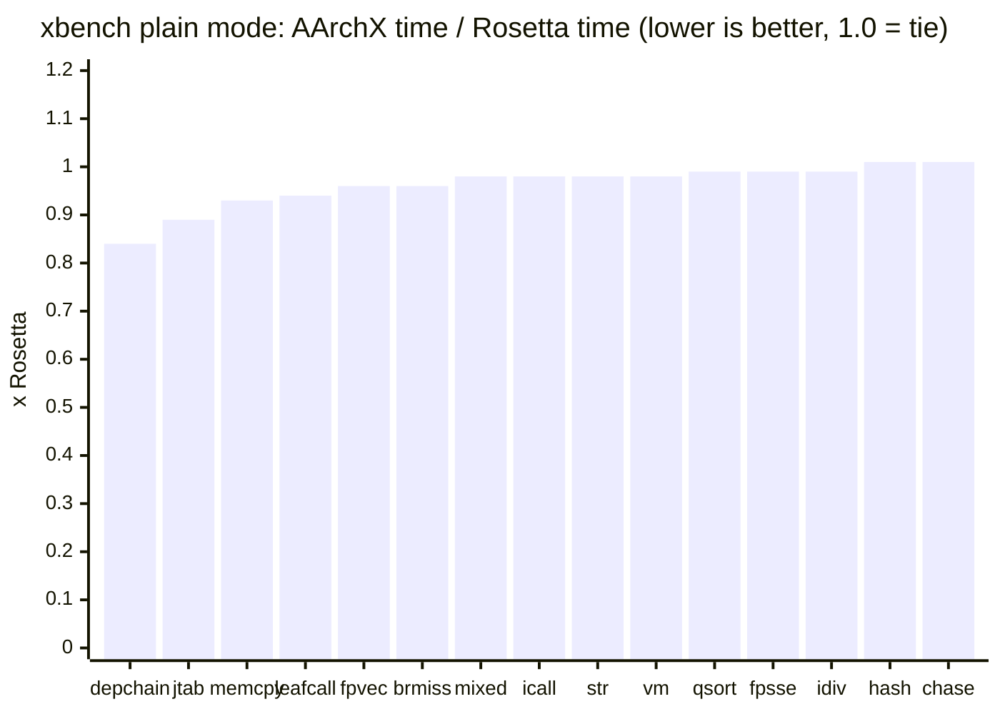

<p align="center">
  
</p>

<h1 align="center"><em>AArchX</em></h1>

<p align="center">
  <b>A from-scratch x86-64 to arm64 userspace binary translator for macOS.</b><br>
  <sub>No Rosetta translation at runtime.</sub><br>
  <sub>Previously called Ocerz. The binary, the source tree and the environment variables still carry that name.</sub>
</p>

<p align="center">
  
  
  
  
</p>

> [!WARNING]
> AArchX is experimental. Do not use it for production workloads.

AArchX loads and runs x86-64 Mach-O programs on Apple Silicon with its own decoder, interpreter, JIT, dynamic linker and syscall layer. It also runs i386 PE code inside Wine's WoW64 process.

The Rosetta package still has to be installed, because it is what ships the x86-64 shared cache. AArchX maps that cache itself and never calls Rosetta's translator.

## Build and run

```sh
make -j
./ocerz version
./ocerz tests/guest/bin/hello
./ocerz /Applications/SomeApp.app/Contents/MacOS/SomeApp
```

`make check` builds the unit and guest tests and runs every gate: the guest suite under the interpreter and under the JIT, the x86-64 differential gate (each guest binary under `-no-jit` and under the JIT must match byte for byte), the i386 differential gate and the dynamic-linking tests. The i386 gate needs the Python `capstone` package.

## Status

| Area | Current result |
| --- | --- |
| arm64 emitter | encodings validated by execution |
| instruction corpus | 511 instructions |
| x86-64 decode | 199 / 199 cases |
| i386 decode | 102 cases, 26 rejects, 122 address cases |
| extension / SSE suites | 233 / 0, 246 / 0, SSE4.2 differential against Rosetta |
| loader / syscall suites | 54 / 0, 324 / 0 |
| memory / shared mappings | 2692 / 0, 91 / 0 |
| i386 interpreter / JIT / WoW64 | passing |
| x86-64 guest gate | 80 / 80 |
| x86-64 differential gate (interpreter vs JIT) | 69 / 69 |
| i386 differential gate | 20,033 / 20,033 |
| dynamic-mode tests | 5 / 5 |
| xbench output vs native | 15 / 15 kernels bit-identical |
| xbench speed vs Rosetta | 13 wins, 2 ties (table below) |
| Wine boot (MacNdCheese build, `cmd /c ver`) | 14 s |

What is in the box:

- Mach-O loader, x86 decoder, interpreter, arm64 JIT, mini-dyld and syscall layer, all written for this project.
- Live `dyld_shared_cache_x86_64` mapping with fixups, initializers, Objective-C registration and `dlopen`/`dlsym`.
- Native guest threads, libdispatch workqueue bridging, Mach messages, signals and x86-TSO memory ordering.
- JIT cache invalidation on guest code writes and executable mapping changes.
- Differential tests for both x86-64 and i386 execution.

## Wine and i386

Wine 11.8 runs x86-64 and i386 PE applications through AArchX. With a WoW64 prefix, 32-bit Notepad and WineMine load `winemac.drv` and open titled Cocoa windows. They stay up. Until 2026-09-05 every Wine GUI process died about 24 seconds in: a CoreSpotlight category that never attached threw inside a dispatch block, and an IOSurface page the kernel mapped for the process sat at an address the guest could not see. Both are fixed; the first is why CoreSpotlight is in the default Objective-C preload list. The Wine launchers turn on the workqueue bridge and the Objective-C category preload that AppKit needs.

```sh
WINE="/path/to/Wine Devel.app/Contents/Resources/wine"
export WINEARCH=wow64
export WINEPREFIX="$HOME/.wine-ocerz"

./ocerz "$WINE/bin/wine" wineboot -u
./ocerz "$WINE/bin/wine" notepad
```

MacNdCheese's Wine build runs under AArchX as well, and Steam is the application the Wine work is measured against. Exceptions raised in 32-bit code now reach the 32-bit handler. Until 2026-09-05 the decoder folded `mov r/m, sreg` into the long-mode constants, so the 32-bit `RtlCaptureContext` recorded the 64-bit code selector, WoW64 copied it into the frame it restores with `iretq`, and the 32-bit exception dispatcher ran as 64-bit code until the stack overflowed. Every Steam process died that way within a second of starting, at its first `OutputDebugString`, and Steam relaunched itself in a loop. Selectors are CPU state now, and a far transfer takes the low 16 bits of a selector slot the way the hardware does, because Wine's `I386_CONTEXT` leaves stack garbage above them. A 32-bit program that raises and catches exceptions runs to completion; the guest tests `mov_sreg` and `far_sel_bits` and the i386 differential case `mov-sreg` pin the behavior. Steam's client core starts: the connectivity test passes and CEF runs the login page's JavaScript. SSE4.2 is implemented and advertised because Steam checks for it.

Memory is the next limit: Steam is nineteen emulated processes, and each one used to carry private copies of every file it mapped, because guest pages are 4 KB and host pages 16 KB. A private file mapping whose file offset and guest address agree modulo 16 KB, which is nearly all of them, now maps its aligned interior straight from the file, so PE images and the fonts Wine enumerates live in the shared page cache. That took 200 MB off a WineMine process and a second off the boot. The test watchdog measures the group's physical footprint rather than RSS, since RSS counts the shared cache in every process.

Rosetta runs i386 PE code through Wine WoW64 too, so AArchX's i386 support is replacement parity rather than something new. Standalone i386 Mach-O applications are not supported by current macOS or its SDKs.

## Benchmarks

Ratio is AArchX time divided by Rosetta time; lower is better.

| Kernel | Ratio |
| --- | ---: |
| `depchain` | **0.84x** |
| `jtab` | **0.89x** |
| `memcpy` | **0.93x** |
| `leafcall` | **0.94x** |
| `fpvec` | **0.96x** |
| `brmiss` | **0.96x** |
| `mixed` | **0.98x** |
| `icall` | **0.98x** |
| `str` | **0.98x** |
| `vm` | **0.98x** |
| `qsort` | **0.99x** |
| `fpsse` | **0.99x** |
| `idiv` | **0.99x** |
| `hash` | 1.01x |
| `chase` | 1.01x |



Apple M2 Max, 2026-09-04, `REPS=5`, paired delta `t(n) - t(n/2)`, byte-identical output. Reproduce with `python3 tests/xbench_compare.py`. `hash` and `chase` are ties that no translation can move: `hash` is a chain of multiply, shift and or per step and both sides are bound by multiply latency; `chase` is a dependent-load chain and both sides wait on the cache. Anything within a couple of percent of 1.00x flips from run to run, and a busy machine moves every ratio by that much.

`mixed` was a 1.20x loss for a long time, and the whole gap was the price of bit-exact x86 NaN semantics: every packed FP result needed a check before anything could use it. The JIT now defers that check to the compares that read the value, and Rosetta-style hot paths that the compiler split with rare-case branches get retranslated with the hot side inline. Both are exact; the NaN tests in `tests/guest` compare bit patterns against the native binary.

These kernels never create a thread, fork or map shared memory, so they run in plain memory mode throughout. A program that does any of those retires plain mode for good (`ocerz_jit_require_ordered`) and pays for x86-TSO ordering on every scalar load and store; Wine is always in that mode. Under `OCERZ_NO_PLAIN_MEM=1` the same table reads 1.35x on `memcpy`, 0.99x on `fpvec`, 1.08x on `str`, 1.13x on `chase` and stays at parity elsewhere. Scalar accesses use acquire and release forms (flags, locks and atomics are scalar, and a release store orders every earlier vector store); SSE loads and stores are left plain, the default FEX ships too, because ordering them cost 3.3x on `memcpy` and 3.0x on `fpvec`. `OCERZ_TSO_VECTOR=1` orders them as well.

Leaving SSE accesses plain is what moved the two kernels that real applications lean on. In ordered memory mode `memcpy` went from 3.55x to 1.35x of Rosetta and `fpvec` from 3.67x to 0.99x, with `str` and `chase` unchanged and everything else at parity.

```mermaid
xychart-beta
    title "Ordered memory mode vs Rosetta: before and after (x time, lower is better)"
    x-axis [memcpy, fpvec]
    y-axis "x Rosetta" 0 --> 4
    bar [3.55, 3.67]
    bar [1.35, 0.99]
```



The tall bars are the previous ordered-mode cost, the short bars the current one; the dark line at 1.0 would be Rosetta's speed.

## CLI

```text
usage: ocerz [-v] [-trace] [-strace] [-no-jit] [-path file] [--] program [args...]
       ocerz version
```

| Option | Effect |
| --- | --- |
| `-v` | more logging |
| `-trace` | trace guest instructions |
| `-strace` | trace guest syscalls |
| `-no-jit` | interpret this process only |
| `-path file` | load `file` but keep the following guest arguments as they are |
| `--` | end of AArchX options |
| `version` | print the name and version (`AArchX 0.1`) |

| Environment | Effect |
| --- | --- |
| `OCERZ_NOJIT=1` | interpret the whole process tree |
| `OCERZ_NOJIT_EXE=<text>` | interpret processes whose command line matches |
| `OCERZ_HOSTWQ=1` | host workqueue bridge |
| `OCERZ_NO_PLAIN_MEM=1` | ordered memory forms from the start |
| `OCERZ_TSO_STRICT=1` | order stack-relative accesses too |
| `OCERZ_TSO_VECTOR=1` | order SSE loads and stores too |
| `OCERZ_PRELOAD_OBJC=<paths>` | preload matching shared-cache Objective-C images so their categories attach; `@cat` preloads every image that defines categories (3-4 s more per boot) |
| `OCERZ_NO_VMMAP_STEER=1` | let `mach_vm_map` place mappings anywhere in host space instead of at guest-visible addresses |
| `OCERZ_EXCLOG=1` | print every Objective-C and C++ exception thrown, with the throw site |
| `OCERZ_WILDLOG=1` | report indirect branches whose target lies outside the guest address space, with the source instruction and registers |
| `OCERZ_MODELOG=1` | print every far transfer with its selector, target mode and target address (the WoW64 32/64 switches) |
| `OCERZ_NO_FILEMAP=1` | read every private file mapping into anonymous memory instead of mapping its 16 KB-aligned interior from the file |
| `OCERZ_STRICT_SYSCALL=1` | abort on an unimplemented syscall instead of returning `ENOSYS` |
| `OCERZ_NO_FLIP=1` | no profile-driven retranslation of superblocks |
| `OCERZ_NO_FPB_DEFER=1` | check every FP batch immediately instead of at its consumers |
| `OCERZ_NO_MOVFUSE=1` | no folding of `mov` into a following shift |

## Architecture

| Component | Source | Responsibility |
| --- | --- | --- |
| Loader | `src/loader.c` | Mach-O parsing, mappings, initial stack |
| Decoder | `src/decode.c` | x86-64/i386 to the 411-operation internal IR |
| Interpreter | `src/interp*.c`, `src/flags.c` | reference execution and x86 flag semantics |
| JIT | `src/jit.c`, `src/a64emit.c` | arm64 code generation, block chaining, superblocks |
| Mini-dyld | `src/dyld.c`, `src/cache.c`, `src/dyldapi.c` | shared cache, symbols, fixups, Objective-C |
| Syscalls | `src/syscall.c` | BSD, Mach, signals, threads and WoW64 host calls |

## Limitations

- Application compatibility is incomplete; unsupported syscalls and framework behavior remain.
- Late-loaded shared-cache Objective-C images are not fully registered in general. Wine uses a targeted preload.
- x87 uses 64-bit doubles rather than 80-bit extended precision.
- Dynamic MXCSR rounding modes and the approximate `RCP`/`RSQRT` results are not implemented.
- Guest protection changes are resolved on the host's 16 KB page boundaries.

## License

[LGPL-2.1](LICENSE)
