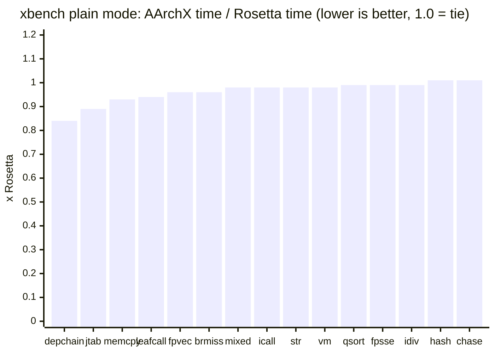

<p align="center">
  
</p>

<h1 align="center"><em>AArchX</em></h1>

<p align="center">
  <b>A from-scratch x86-64 to arm64 userspace binary translator for macOS.</b><br>
  <sub>No Rosetta translation at runtime.</sub><br>
  <sub>Previously called Ocerz. The binary, the source tree and the environment variables still carry that name.</sub>
</p>

<p align="center">
  
  
  
  
</p>

> [!WARNING]
> AArchX is experimental. Do not use it for production workloads.

AArchX loads and runs x86-64 Mach-O programs on Apple Silicon with its own decoder, interpreter, JIT, dynamic linker and syscall layer. It also runs i386 PE code inside Wine's WoW64 process.

AArchX has two modes. Cache mode, the default, binds guests against the x86-64 shared cache, and for it the Rosetta package still has to be installed, because it is what ships that cache; AArchX maps the cache itself and never calls Rosetta's translator. Native mode (`-native`) binds guests against the Mac's own arm64 frameworks instead and needs no x86 system libraries at all, but it runs a narrower set of programs so far (see [Native mode](#native-mode)). Every application below was run in cache mode.

## Build and run

```sh
make -j
./ocerz version
./ocerz tests/guest/bin/hello
./ocerz /Applications/SomeApp.app/Contents/MacOS/SomeApp
```

`make check` builds the unit and guest tests and runs every gate: the guest suite under the interpreter and under the JIT, the x86-64 differential gate (each guest binary under `-no-jit` and under the JIT must match byte for byte), the i386 differential gate, the dynamic-linking tests and the native-mode tests. The i386 gate needs the Python `capstone` package, and the dynamic and native gates build x86_64 fixtures with the Command Line Tools' clang.

Native mode reads its API database from `runtime/apis` beside the `ocerz` binary, so run it from the source tree or keep that directory next to a copied binary:

```sh
./ocerz -native ./some_x86_64_tool
```

## Status

| Area | Current result |
| --- | --- |
| arm64 emitter | encodings validated by execution |
| instruction corpus | 511 instructions |
| x86-64 decode | 246 / 246 cases |
| i386 decode | 102 cases, 26 rejects, 122 address cases |
| extension / SSE suites | 237 / 0, 246 / 0, SSE4.2 differential against Rosetta |
| loader / syscall suites | 54 / 0, 365 / 0 |
| memory / shared mappings | 2692 / 0, 105 / 0 |
| i386 interpreter / JIT / WoW64 | passing |
| x86-64 guest gate | 131 / 131 |
| x86-64 differential gate (interpreter vs JIT) | 97 / 97 |
| i386 differential gate | 20,033 / 20,033 |
| dynamic-mode tests | 113 / 113 |
| native-mode gate (`-native`) | 87 / 87 (macOS 27, 2026-09-21) |
| native-mode unit suites: API database, image, bridge, ABI, callbacks, thread attach, Objective-C, blocks | 334 / 0, 142426 / 0, 1247 / 0, 28071 / 0, 131974 / 0, 270 / 0, 125400 / 0, 107 / 0 |
| in-place string and memory routines against the host's | 6,736,902 / 0 |
| real macOS apps opening their main window | 10 in cache mode, 3 in native mode (see [Application compatibility](#application-compatibility)) |
| xbench output vs native | 15 / 15 kernels bit-identical |
| xbench speed vs Rosetta | static build 11 wins and 4 losses of at most 5%; dynamically linked build 14 wins, 1 loss of 3% (tables below) |
| Wine boot (MacNdCheese build, `cmd /c ver`) | 14 s |

What is in the box:

- Mach-O loader, x86 decoder, interpreter, arm64 JIT, mini-dyld and syscall layer, all written for this project.
- Live `dyld_shared_cache_x86_64` mapping with fixups, initializers, Objective-C registration and `dlopen`/`dlsym`.
- Native guest threads, libdispatch workqueue bridging, Mach messages, signals and x86-TSO memory ordering.
- x86-64-v3 as Rosetta runs it on macOS 15 and later: AVX2, FMA, BMI1/BMI2, F16C, LZCNT, MOVBE and XSAVE, none of which CPUID advertises under either.
- JIT cache invalidation on guest code writes and executable mapping changes.
- Differential tests for both x86-64 and i386 execution.
- An opt-in native mode that runs Intel programs against synthesized x86 system images bridged to the host's own arm64 libSystem, CoreFoundation, CoreGraphics, Objective-C runtime, Foundation and AppKit, in both directions and with blocks crossing both ways, without the x86 shared cache. It runs command-line C and Objective-C programs, Cocoa applications whose calls stay inside what it bridges, such as Image Capture and Stickies, and the x86-64 Steam client.

## Application compatibility

Everything in this section runs in cache mode. In native mode Image Capture opens its main window, Stickies a note and Steam its client window; what stops the other system applications there is listed under [Native mode](#native-mode).

Confirmed on 2026-09-11 on an Apple silicon MacBook Air with macOS 26.6.
Each app's x86-64 slice was launched straight from its bundle, for example
`./ocerz /System/Applications/Chess.app/Contents/MacOS/Chess`. Here "works"
means the app drew its main window on screen and stayed up.

| Application | Result under AArchX |
| --- | --- |
| Chess | works and plays: board window, and the `sjeng` engine subprocess answers moves |
| Calculator | works (window on screen) |
| Dictionary | works (window on screen) |
| Font Book | works (window on screen) |
| Grapher | works (window on screen) |
| Digital Color Meter | works (window on screen) |
| Activity Monitor | window on screen; its force-quit support library is not in the x86-64 shared cache |
| Console | window on screen; logs a missing optional library |
| TextEdit / Preview / Script Editor | run; open a document window when given a file to open |
| Safari | works (2026-09-21, owner-confirmed): the browser runs and browses. It is not part of any gate, and its startup has not been timed. |
| Steam (x86-64 client) | works with `-cef-disable-gpu` (2026-09-12): bootstrapper, `ipcserver`, client and the CEF web helper with GPU, utility and renderer processes; the window draws with software rendering. Some launches still stall before the web UI starts. See [Steam](#steam). |

Command-line tools match their native output byte for byte
(`tools/apptest.sh cli`, 15 of 16 on macOS 27): `uname`, `echo`, `ls`, `id`,
`basename`, `wc`, `sort`, `uniq`, `head`, `grep`, `file`, `xxd`, `nm`,
`plutil` and `openssl` (`version` and `dgst -sha256`). A wider sweep of 74
system tools run with read-only arguments, against the same x86-64 slice under
Rosetta, agrees on every one of them; the only disagreements are the tools whose
output is expected to differ between two runs, such as `ps` and `vm_stat`.

The sixteenth is `sw_vers`, which fails on macOS 27 and passed before: Apple
rewrote it in Swift, and under AArchX it loads `libswiftCore.dylib` and then
faults at the bottom of its stack with a repeating frame pattern, which is what
unbounded recursion looks like. It fails the same way under the interpreter, so
it is not a translation bug, and the cause is not yet known. Swift is the
largest single thing AArchX does not handle, and Apple is moving system tools
onto it.

Ollama's command-line binary (`Contents/Resources/ollama`, Go with cgo) works as of 2026-09-13. `ollama --version` prints what it prints natively. `ollama serve` answers its HTTP API (`/api/version`, `/api/tags`, `/api/show`), and `llama-server --list-devices` lists the same devices as it does natively. Getting there took five fixes:
- AVX2, because Go turns on its AVX2 paths under Rosetta without checking CPUID.
- `sigaltstack` reporting `SS_DISABLE`.
- `dlopen` refusing arm64-only dylibs.
- Bare `@loader_path` rpaths.
- Constructors in programs that do not link CoreFoundation.

The Ollama menu-bar app runs too. In a 30-second run it started its own server, served its settings page to its window and shut down cleanly on SIGTERM. Before that, WebKit's allocator stopped it within 10 seconds because it could not suspend a thread (`thread_suspend` returned `MACH_SEND_INVALID_DEST`): workqueue threads that AArchX started ended without running the guest's thread-exit path. Nobody has yet run a model under AArchX.

Safari took the longest to get there. It used to start and never show a window: in a run on 2026-09-13, WebKit's allocator failed to suspend a thread (`thread_suspend` returned `MACH_SEND_INVALID_DEST`) and stopped the process. The main thread was missing from AArchX's thread-suspension emulation, and workqueue threads that AArchX started ended without running the guest's thread-exit path; both were fixed that day, and the WebKit work continued through macOS 27.

Not working yet:
- **Photos** aborted in `+[PAOpenGLDevice _sharedPixelFormat:]` because `CGLChoosePixelFormat` returned 10002 for every attribute set. The cause was in AArchX's dyld, not the Rosetta-only `AppleMetalGLRenderer` IOKit service blamed earlier. `_dyld_shared_cache_contains_path` rejected the software renderer's plugin path, which runs through a symlink, and `dlsym` on a shared-cache image searched the whole cache. Both are fixed, and CGL now lists the same renderers and builds the same pixel formats as under Rosetta. Photos has not been run again since.

## Steam

The x86-64 macOS Steam client comes up with its full UI under AArchX, confirmed 2026-09-12: the bootstrapper, `ipcserver`, the client and the CEF web helper with its GPU, utility and renderer processes, all translated, with the Steam window on screen. After its first update the client lives in Application Support, and CEF has to run without GPU acceleration:

```sh
./ocerz "$HOME/Library/Application Support/Steam/Steam.AppBundle/Steam/Contents/MacOS/steam_osx" -cef-disable-gpu
```

Getting the client this far took SysV semaphores for Steam's tier0 threading, an absolute executable path (Steam derives its bundle root from it), `dlopen` of the executable returning the already loaded main image, C++ initializers run in dependency order, and a guest arena big enough for Chromium's PartitionAlloc, which reserves a 32 GB region at startup. The arena is now 256 GB, because JavaScriptCore's Gigacage asks for a single 128 GB mapping.

`steam_osx` starts `ipcserver` with `launchctl load -S Background` on a plist it writes into Application Support, which would have launchd run it natively. AArchX rewrites that plist on the way through, putting itself in front of `ProgramArguments` and in `Program` (Steam's own plist only has `Program`, so the array is built from it), and enables the job's label first: a legacy `launchctl unload` leaves the label disabled, and every load after that fails with an I/O error while the client reports `ipcserver init failed`. The Mach service lookup itself was never the problem, since Mach traps go straight to the host kernel.

CEF's GPU process initializes ANGLE through CGL. Until the dyld fixes described under Photos above, every CGL pixel format failed, so CEF ran with `-cef-disable-gpu` and rendered through SwiftShader, which works and is slower. Steam has not been tried with GPU acceleration since those fixes.

The client then waits for the web helper to report ready, polling every 50 ms for 120 s, and gives up on the UI if it does not. Three JIT problems kept the helper from making it:

- Threads blocked on the JIT lock could lose their wakeup and wedge translation for the whole process. The lock is now taken with trylock, yields and short sleeps, and never parks.
- A page invalidated three times was left to the interpreter until it had been quiet for 1.5 s. Hot shared-cache pages in ICU, libdispatch and Foundation never went quiet: one ICU page was refused translation about 30 million times in a two-minute run. A blacklisted page is now also retranslated after 4096 refusals.
- An alignment or commpage fault marks its block and invalidates its 64 KB granule, and the JIT's code index still finds retired blocks. Every other thread still running the retired translation faulted as well, found the block already marked, and invalidated the granule again, discarding the translation that had just been fixed. A fault from a retired translation now simply recovers.

The last two changes took translate refusals from about 25 million to under 64 thousand per run, and the renderer has come up 85 to 151 s after launch. Some launches still stall before the web helper starts its child processes, with the JIT lock held inside translation; relaunching gets past it.

Three helper failures are fixed since. Renderers died on libc++'s `sort.h:643: assertion __first != __end failed: Would read out of bounds, does your comparator satisfy the strict-weak ordering requirement?`: the JIT fused a `cmp`/`jcc` pair whose branch returns to the top of its own block and jumped back without recording the flags, and libc++'s partition loop starts with a `jbe` on the previous iteration's compare. Such self-loops are no longer fused when their head reads flags; `tests/dynamic/cef_partition.s` is that loop. The sandboxed GPU, utility and renderer processes also loaded the 386 MB CEF framework twice, because the helper `dlopen`s it again through the `Contents/Frameworks` symlink and `realpath` fails inside the sandbox; loaded images are now matched by device and inode, as dyld does. Steam's `hardwareupdater`, a PyInstaller Python, crashed until upward links in the `dylib_use_command` form of `LC_LOAD_DYLIB` stopped counting as initializer-order edges.

On 2026-09-21, on macOS 27, the same client also came up in native mode (`./ocerz -native ...steam_osx`): the login window, then the 1280 by 800 Steam window with its menus built and the store view loading, the GPU process running hardware ANGLE over the host's own OpenGL, and two renderers, stable for minutes with nothing reported by ocerz. From the web helper starting to the main window took 23 s in native mode and 34 s in cache mode on the same machine (44 s from launch); the arm64 Steam takes 2 to 4 s. Neither run is part of a gate. Getting there in native mode took, among other things, x86 thunks for native Objective-C implementations the guest receives, a guest-owned `errno` slot and thread-specific-data keys, views of the host's malloc zones so that Chromium's hooks never land in a zone native code calls through, a 4 KB page size answered everywhere, the guest's own stack bounds for V8's stack scanner, databases for libGL and the legacy SystemConfiguration exports of IOKit, the sandbox calls made only after every API database is loaded, a database record for function pointers inside guest-owned structures (zlib's allocator hooks), and the rewritten `ipcserver` job started in the mode its parent runs in. What remains known: `hardwareupdater` fails to run its script, and several imports Steam has not reached yet are still stubs.

`Steam Helper` is launched with `--use-mock-keychain`. Without it Chromium reads its "Steam Safe Storage" item from the login keychain at startup; the item does not trust the ocerz binary, so macOS asked for the password once per helper process, and the helper blocks until the prompt is answered. Cookies CEF stores under AArchX are encrypted with the mock key instead, so they are not readable by a native Steam, nor the reverse. `OCERZ_NO_MOCK_KEYCHAIN=1` turns this off. The flag is also added when `Steam Helper` is launched directly rather than by Steam, where Steam's own command line is not there to carry it and the keychain dialog would name ocerz.

## Wine and i386

Wine 11.8 runs x86-64 and i386 PE applications through AArchX. With a WoW64 prefix, 32-bit Notepad and WineMine load `winemac.drv` and open titled Cocoa windows. They stay up. Until 2026-09-05 every Wine GUI process died about 24 seconds in: a CoreSpotlight category that never attached threw inside a dispatch block, and an IOSurface page the kernel mapped for the process sat at an address the guest could not see. Both are fixed; the first is why CoreSpotlight is in the default Objective-C preload list. The Wine launchers turn on the Objective-C category preload that AppKit needs; the workqueue bridge is on for every process now, because a Cocoa application deadlocks without it.

```sh
WINE="/path/to/Wine Devel.app/Contents/Resources/wine"
export WINEARCH=wow64
export WINEPREFIX="$HOME/.wine-ocerz"

./ocerz "$WINE/bin/wine" wineboot -u
./ocerz "$WINE/bin/wine" notepad
```

MacNdCheese's Wine build runs under AArchX as well, and Steam is the application the Wine work is measured against. Exceptions raised in 32-bit code now reach the 32-bit handler. Until 2026-09-05 the decoder folded `mov r/m, sreg` into the long-mode constants, so the 32-bit `RtlCaptureContext` recorded the 64-bit code selector, WoW64 copied it into the frame it restores with `iretq`, and the 32-bit exception dispatcher ran as 64-bit code until the stack overflowed. Every Steam process died that way within a second of starting, at its first `OutputDebugString`, and Steam relaunched itself in a loop. Selectors are CPU state now, and a far transfer takes the low 16 bits of a selector slot the way the hardware does, because Wine's `I386_CONTEXT` leaves stack garbage above them. A 32-bit program that raises and catches exceptions runs to completion; the guest tests `mov_sreg` and `far_sel_bits` and the i386 differential case `mov-sreg` pin the behavior. Steam's client core starts: the connectivity test passes and CEF runs the login page's JavaScript. SSE4.2 is implemented and advertised because Steam checks for it.

Memory is the next limit: Steam is nineteen emulated processes, and each one used to carry private copies of every file it mapped, because guest pages are 4 KB and host pages 16 KB. A private file mapping whose file offset and guest address agree modulo 16 KB, which is nearly all of them, now maps its aligned interior straight from the file, so PE images and the fonts Wine enumerates live in the shared page cache. That took 200 MB off a WineMine process and a second off the boot. The other big item was the JIT's own bookkeeping: every translated block kept the full 96-byte decode of each of its instructions and a fixed table of eight branch edges, 1.6 KB per block across 215,000 blocks. A published block now keeps a 16-byte reference per instruction, full copies only of the few instructions it still runs through the interpreter or inspects during fault recovery, and exactly the edges it has. A WineMine process went from 1.1 GB to 714 MB of footprint over the two changes, explorer from 860 MB to 611 MB, with the xbench table unchanged. The test watchdog measures the group's physical footprint rather than RSS, since RSS counts the shared cache in every process.

Rosetta runs i386 PE code through Wine WoW64 too, so AArchX's i386 support is replacement parity rather than something new. Standalone i386 Mach-O applications are not supported by current macOS or its SDKs.

## Benchmarks

Ratio is AArchX time divided by Rosetta time; lower is better.

| Kernel | Ratio |
| --- | ---: |
| `depchain` | **0.84x** |
| `jtab` | **0.89x** |
| `memcpy` | **0.93x** |
| `leafcall` | **0.94x** |
| `fpvec` | **0.96x** |
| `brmiss` | **0.96x** |
| `mixed` | **0.98x** |
| `icall` | **0.98x** |
| `str` | **0.98x** |
| `vm` | **0.98x** |
| `qsort` | **0.99x** |
| `fpsse` | **0.99x** |
| `idiv` | **0.99x** |
| `hash` | 1.01x |
| `chase` | 1.01x |



The table and chart above are from an Apple M2 Max on 2026-09-04; the tables further down are from an Apple M5 on 2026-09-21. `REPS=5`, paired delta `t(n) - t(n/2)`, byte-identical output. Reproduce with `python3 tests/xbench_compare.py`. `hash` and `chase` are ties that no translation can move: `hash` is a chain of multiply, shift and or per step and both sides are bound by multiply latency; `chase` is a dependent-load chain and both sides wait on the cache. Anything within a couple of percent of 1.00x flips from run to run, and a busy machine moves every ratio by that much.

The same suite built for x86-64-v3 (`clang -march=x86-64-v3`, so AVX2, FMA and BMI throughout) used to lose ten kernels, three of them by 4x to 13x, because its VEX and BMI instructions went to the interpreter. On 2026-09-15, on an Apple M5, it wins twelve of the fifteen (`vm` 0.73x, `fpsse` 0.77x, `jtab` 0.91x, `mixed` 0.93x, `memcpy` 0.94x, `fpvec` 0.96x) and loses none by more than 7% (`str` 1.06x, `leafcall` 1.03x, `idiv` 1.00x). The same day's run of the SSE2 build on that machine: ten wins, five losses, none above 1.06x.

`mixed` was a 1.20x loss for a long time, and the whole gap was the price of bit-exact x86 NaN semantics: every packed FP result needed a check before anything could use it. The JIT now defers that check to the compares that read the value, and Rosetta-style hot paths that the compiler split with rare-case branches get retranslated with the hot side inline. Both are exact; the NaN tests in `tests/guest` compare bit patterns against the native binary.

The deferred check has since become one batch per run of floating-point work: zeroing, unpacks, `movddup`, stores, and `ucomisd` with its branch all stay inside the batch, a stored value is checked right before the store, a branch out of the loop carries its check in the exit stub, and at the batch's end only the registers the loop still reads are checked. nbody's SSE2 pair loop went from 107 to 86 host instructions per iteration that way, 42 of which had been NaN bookkeeping. The VEX.128 arithmetic and the scalar FMA forms are batch members too, registers that only ever hold doubles are reduced as doubles (a `fmaxv.4s` over a double reports a NaN for one value in 256), and `tests/run_guest_tests.sh` runs the NaN tests once more with every deferred check forced to take its replay arm. A store that might alias an earlier load of the batch used to end it, because the replay re-executes the loads; the batch now keeps the memory it is about to overwrite in a spare vector register and the replay arm writes it back first, so a loop that updates its data in place is one batch. Those pre-images live in registers rather than the CPU struct: the nbody loop turned out to be bound by its stores, and four extra stores per iteration cost more than the merged batch gained. Packed FMA is a batch member, and a block with VEX.128 code clears the upper halves through a zero register, one 16-byte store instead of two. Two adjacent 16-byte moves become one `ldp` or `stp`; a fault on such a pair is re-run from its first instruction in the interpreter, so the guest sees the signal at the right one. A `vzeroupper` in a block without 256-bit instructions tests a per-thread flag and skips its sixteen stores when the upper halves are already zero, and a stack access through `rsp` folds its displacement into the load or store instead of computing the address first.

### 2026-09-21, Apple M5: both builds, every mode

| Kernel | static | static, ordered | dynamic, cache mode | dynamic, cache, ordered | dynamic, native mode |
| --- | ---: | ---: | ---: | ---: | ---: |
| `icall` | **0.92x** | **0.98x** | **0.93x** | **0.82x** | **0.84x** |
| `jtab` | **0.89x** | **0.86x** | **0.98x** | **0.92x** | **0.97x** |
| `depchain` | **0.90x** | **0.90x** | **0.90x** | **0.90x** | **0.90x** |
| `brmiss` | **0.97x** | **0.99x** | **0.97x** | **0.98x** | **0.96x** |
| `memcpy` | 1.04x | 1.22x | **0.72x** | **0.73x** | **0.73x** |
| `str` | 1.05x | 1.16x | **0.77x** | **0.96x** | **0.82x** |
| `hash` | 1.00x | 1.00x | **0.99x** | **0.99x** | **0.99x** |
| `idiv` | **0.99x** | **0.99x** | **0.99x** | **0.99x** | **0.99x** |
| `fpsse` | **0.86x** | **0.88x** | **0.86x** | **0.86x** | **0.85x** |
| `fpvec` | **0.82x** | **0.82x** | **0.80x** | **0.83x** | 1.05x |
| `chase` | 1.00x | 1.23x | 1.00x | 1.22x | 1.00x |
| `qsort` | **0.98x** | 1.04x | **0.97x** | 1.04x | **0.97x** |
| `leafcall` | 1.03x | 1.02x | 1.03x | 1.03x | 1.03x |
| `mixed` | **0.88x** | **0.88x** | **0.83x** | **0.80x** | **0.90x** |
| `vm` | **0.85x** | **0.83x** | **0.84x** | **0.76x** | **0.73x** |

The static build is the freestanding one the table at the top measures. The dynamically linked build (`XB=tests/guest/benchbin/xbench_dyn`) is the same source linked against libSystem, so its `memcpy` and `str` kernels spend their time in the system's `memmove` and `strlen`; "ordered" is `OCERZ_NO_PLAIN_MEM=1`, the x86-TSO mode every program with a second thread runs in; native mode is `OCERZ_MODE=native`. Three changes made on that day account for most of the difference from the older table.

**NaN results from the processor.** x86 and arm64 disagree about NaNs: an invalid operation gives a negative default NaN on one and a positive one on the other, and when both operands are NaNs x86 returns the first where arm64 lets a signalling one win. Everything in the paragraphs below about deferred checks and batches exists to get x86's answer out of arm64 arithmetic. A processor that reports `FEAT_AFP` (`sysctl hw.optional.arm.FEAT_AFP`; the M5 these numbers come from does) can do it itself: with FPCR.AH set, add, subtract, multiply, divide and square root follow SSE's rule as long as the x86 destination is the first arm64 operand, and the default NaN is x86's. AArchX now sets that bit on every guest thread in cache mode and emits those operations bare; a batch made only of them, moves, shuffles, compares and stores keeps its fast emission and loses its checkpoint, checks, undo log and replay arms. In `fpvec` the end-of-batch check was three vector operations on top of the eight doing the work and the four vector pipelines were the limit, so the kernel went from 1.06x to 0.82x, and the x86-64-v3 build's from 0.96x to 0.58x. Fused multiply-add keeps its check, because its negated forms negate a NaN operand that x86 returns as it came. Native mode keeps the translated checks: the host's own code runs on guest threads there, a crossing would have to clear the bit and set it again, and two FPCR writes cost about 14 ns. `OCERZ_NO_AFP=1` keeps the translated checks everywhere, which is also what a processor without the bit gets, and `tests/run_guest_tests.sh` runs the NaN tests a second and third time that way so the path stays covered on a machine that no longer needs it. `tests/dynamic/nan_contexts.c` checks the results on the main thread, a pthread, in and after a signal handler, on libdispatch's threads, after an MXCSR write and across `fork`; writing it found that the main thread of a dynamically linked program had never been given the guest's floating-point control state at all.

**String and memory routines in place.** `strlen`, `strnlen`, `strcmp`, `strncmp`, `memcmp`, `bcmp`, `strchr`, `memchr`, `memcpy`, `memmove` and `memset` are called constantly and do very little. `src/leaf.s` holds arm64 versions of them under a private contract: arguments are read from the host registers that hold `rdi`, `rsi` and `rdx`, the result is left in the one that holds `rax`, and nothing else the translation depends on is touched, so translated code reaches one with a single direct branch and spills nothing. In cache mode a block that starts at the exported entry of one of Apple's x86 routines gets that call ahead of its first instruction, with the translation of the x86 code following for the cases the routine declines; a fault inside a routine is never reported from there, the handler makes the routine decline and the x86 code takes the same fault, so a handler sees exactly what it would have seen. `memmove` declines overlapping moves, the one case where doing part of the work and then all of it is not the same as doing it once. `OCERZ_NO_LEAF_INPLACE=1` turns the routines off. What native mode gains is under [Native mode](#native-mode).

**The system's `memmove` in ordered mode.** Before the routines above existed, the dynamically linked `memcpy` kernel was 4.6x slower than under Rosetta in ordered mode. Apple's x86 `memmove` copies eight bytes at a time from wherever the pointers happen to be, nearly half of those accesses straddled a 16-byte boundary, and an ordered access that straddles one takes a barrier. libsystem_platform's string and memory routines are now translated with plain accesses, which is what they are under Rosetta too (`OCERZ_NO_MEMFN_PLAIN=1` turns that off); that alone brought the kernel to 0.98x.

What is left: `leafcall` is three percent behind everywhere, with both calls already inlined into the loop. `chase` in ordered mode is the addressing floor described below, and the static build's `memcpy` and `str` in ordered mode are their own x86 loops doing unaligned ordered accesses. `fpvec` in native mode is the NaN check the other modes no longer make.

These kernels never create a thread, fork or map shared memory, so they run in plain memory mode throughout. A program that does any of those retires plain mode for good (`ocerz_jit_require_ordered`) and pays for x86-TSO ordering on every scalar load and store; Wine is always in that mode. Under `OCERZ_NO_PLAIN_MEM=1` the M2 Max table read 1.35x on `memcpy`, 0.99x on `fpvec`, 1.08x on `str`, 1.13x on `chase` and stayed at parity elsewhere; the M5 column above is the current state. Scalar accesses use acquire and release forms (flags, locks and atomics are scalar, and a release store orders every earlier vector store); SSE loads and stores are left plain, the default FEX ships too, because ordering them cost 3.3x on `memcpy` and 3.0x on `fpvec`. `OCERZ_TSO_VECTOR=1` orders them as well.

Leaving SSE accesses plain is what moved the two kernels that real applications lean on. In ordered memory mode `memcpy` went from 3.55x to 1.35x of Rosetta and `fpvec` from 3.67x to 0.99x, with `str` and `chase` unchanged and everything else at parity.

```mermaid
xychart-beta
    title "Ordered memory mode vs Rosetta: before and after (x time, lower is better)"
    x-axis [memcpy, fpvec]
    y-axis "x Rosetta" 0 --> 4
    bar [3.55, 3.67]
    bar [1.35, 0.99]
```



The tall bars are the previous ordered-mode cost, the short bars the current one; the dark line at 1.0 would be Rosetta's speed.

### AVX2, FMA and SSE kernels

Every VEX-encoded instruction used to leave translated code for the interpreter, so AVX2 and FMA loops ran up to 100 times slower than under Rosetta. The JIT now translates the instructions these kernels spend their time in.

Timings are best of 5 on an Apple M5 with macOS 26.6.2, taken 2026-09-14 on an idle machine; the nbody and mandelbrot rows were re-measured on 2026-09-15, all three columns in one sitting. "Before" is the build at `31bff03`.

| Kernel | Before | Now | Rosetta |
| --- | ---: | ---: | ---: |
| `memclr` 32 MB, AVX2 `vmovdqu` | 24.12 ms | 0.57 ms | 0.56 ms |
| `indexbyte` 32 MB, AVX2 | 71.98 ms | **0.85 ms** | 1.48 ms |
| `memeq` 32 MB, AVX2 | 64.79 ms | **0.86 ms** | 1.72 ms |
| int32 loop 4M, clang AVX2 | 135.35 ms | **0.44 ms** | 1.30 ms |
| int32 loop 4M, clang SSE4.1 | 29.48 ms | **0.56 ms** | 0.78 ms |
| saxpy 4M, clang AVX2+FMA | 37.62 ms | **0.33 ms** | 0.48 ms |
| nbody 200k steps, scalar SSE2 | 72.90 ms | 6.13 ms | 5.92 ms |
| nbody 200k steps, scalar AVX2 | 1125.37 ms | **6.97 ms** | 10.57 ms |
| nbody 200k steps, scalar AVX2+FMA | 904.45 ms | **6.31 ms** | 9.47 ms |
| mandelbrot 400x400, scalar SSE2 | 19.97 ms | 12.07 ms | 11.26 ms |
| mandelbrot 400x400, scalar AVX2 | 828.24 ms | **10.95 ms** | 11.44 ms |

Wine runs in a third address map, the low shadow, where every memory access needs a range check because guest addresses below 12 GB and a strip at the top of the address space live at their own host bases. The scalar and 256-bit register caches run there now that fault recovery reconstructs them, but the fast memory forms, base hoisting, move pairs and the batch undo log still need a host address that can be formed without a check, so the suite is slower than Rosetta in that map.

The first three kernels are hand-written loops shaped like Go's runtime routines. The rest are C loops, which clang vectorizes except for nbody and mandelbrot, which stay scalar.

Scalar floating-point loops now take 0.9 to 1.2 times Rosetta's time, whether they were built for SSE2 or for x86-64-v3. The scalar results stay in host lane registers across a loop instead of being merged back into the guest register after every operation, and 256-bit loops keep the upper halves of their `ymm` registers in host registers too.

## CLI

```text
usage: ocerz [-v] [-trace] [-strace] [-no-jit] [-native|-cache] [-path file] [--] program [args...]
       ocerz version
```

| Option | Effect |
| --- | --- |
| `-v` | more logging |
| `-trace` | trace guest instructions |
| `-strace` | trace guest syscalls |
| `-no-jit` | interpret this process only |
| `-native` | bind the guest against native arm64 frameworks instead of the x86 shared cache (see [Native mode](#native-mode)) |
| `-cache` | bind the guest against Apple's x86_64 shared cache; the default |
| `-path file` | load `file` but keep the following guest arguments as they are |
| `--` | end of AArchX options |
| `version` | print the name and version (`AArchX 0.2-dev`) |

| Environment | Effect |
| --- | --- |
| `OCERZ_MODE=native\|cache` | pick the mode when no flag does; this is how a spawned child inherits it, and an unrecognized value is refused rather than ignored |
| `OCERZ_BRIDGESTAT=1` | in native mode, print how many times each bridged function was called, at exit |
| `OCERZ_BRIDGELOG=1` | in native mode, name every bridged call as it happens |
| `OCERZ_NO_BRIDGE_FASTCALL=1` | in native mode, have translated code reach every bridged call through the trap and the dispatcher instead of calling the bridge from inside the block |
| `OCERZ_APIDB=dir` | in native mode, read the API database from `dir` instead of `runtime/apis` beside the ocerz executable |
| `OCERZ_NOJIT=1` | interpret the whole process tree |
| `OCERZ_NOJIT_EXE=<text>` | interpret processes whose command line matches |
| `OCERZ_NO_HOSTWQ=1` | turn the host workqueue bridge off (it is on by default; `OCERZ_HOSTWQ=1` is still accepted and still means on) |
| `OCERZ_NO_LOADMAP=1` | do not drive a cache image's objc `map_images` before its `+load` runs (it is on by default; the map precedes load as native dyld does, so a framework pulled up only as a transitive dependency does not reach `+load` with un-mapped classes) |
| `OCERZ_NO_UNSTICK=1` | never EINTR a guest thread out of a long wait (the unstick monitor otherwise kicks psynch, semwait, kevent, workq, ulock and Mach waits parked over 800 ms) |
| `OCERZ_NO_THREADACT=1` | hand `thread_suspend`/`thread_resume`/`thread_get_state` on guest threads to the host kernel instead of emulating them (the kernel stops a thread anywhere, even holding the JIT lock, and cannot report x86 registers) |
| `OCERZ_UNSTICK_ALL=1` | let the unstick monitor kick every blocking call, `read`/`recvmsg`/`poll` included, as it used to; apps that do not expect EINTR there fail |
| `OCERZ_NO_PLAIN_MEM=1` | ordered memory forms from the start |
| `OCERZ_NO_AFP=1` | keep the translated NaN checks even where the processor has FPCR.AH (`FEAT_AFP`), which otherwise produces x86's NaN results itself in cache mode |
| `OCERZ_NO_LEAF_INPLACE=1` | reach `strlen`, `memcpy` and the other nine string and memory routines the ordinary way (Apple's x86 code in cache mode, a bridged call in native mode) instead of through the arm64 routines of `src/leaf.s` |
| `OCERZ_NO_MEMFN_PLAIN=1` | translate libsystem_platform's string and memory routines with ordered accesses when the rest of the process has them |
| `OCERZ_TSO_STRICT=1` | order stack-relative accesses too |
| `OCERZ_TSO_VECTOR=1` | order SSE loads and stores too |
| `OCERZ_PRELOAD_OBJC=<paths>` | put matching shared-cache Objective-C images into the startup batch; `@cat` does it for every image that defines categories (3-4 s more per boot) |
| `OCERZ_NO_LATE_CATLIST=1` | do not report category lists for shared-cache images loaded after startup, so their categories miss classes that are already realized |
| `OCERZ_NO_VMMAP_STEER=1` | let `mach_vm_map` place mappings anywhere in host space instead of at guest-visible addresses |
| `OCERZ_EXCLOG=1` | print every Objective-C and C++ exception thrown, with the throw site |
| `OCERZ_WILDLOG=1` | report indirect branches whose target lies outside the guest address space, with the source instruction and registers |
| `OCERZ_MODELOG=1` | print every far transfer with its selector, target mode and target address (the WoW64 32/64 switches) |
| `OCERZ_NO_FILEMAP=1` | read every private file mapping into anonymous memory instead of mapping its 16 KB-aligned interior from the file |
| `OCERZ_NO_COMPACT=1` | keep every block's full decoded instruction array after translation |
| `OCERZ_STRICT_SYSCALL=1` | abort on an unimplemented syscall instead of returning `ENOSYS` |
| `OCERZ_NO_FLIP=1` | no profile-driven retranslation of superblocks |
| `OCERZ_NO_FPB_DEFER=1` | check every FP batch immediately instead of at its consumers |
| `OCERZ_NO_MOVFUSE=1` | no folding of `mov` into a following shift |
| `OCERZ_REFAULT_INVAL=1` | invalidate again on every repeat alignment or commpage fault, including faults from retired translations (the old behaviour) |
| `OCERZ_IPCLOG=1` | send the translated `ipcserver`'s output to `/tmp/ocerz_ipcserver.err` |
| `OCERZ_JITLOCKLOG=1` | report JIT lock waits over 3 s with the holder's thread, acquire site, guest `rip` and kernel thread state |
| `OCERZ_BLACKLOG=1` | print the pages most often refused translation because they churned |
| `OCERZ_INVSRC=1` | attribute each churn strike to the code that invalidated the page, as an offset from `ocerz_jit_step` |
| `OCERZ_XLATPAGES=1` | log each distinct 4 KB page a process translates |
| `OCERZ_NO_NATIVE_CHILDREN=1` | in native mode, run the system tools a guest starts under ocerz as well; by default one outside the shells and launchers that has an arm64 slice runs as itself |
| `OCERZ_NO_TSD_DTORS=1` | in native mode, do not run the destructors of the guest's thread-specific data keys at thread exit |
| `OCERZ_DLPATH=1` | print every `dlopen` and `dlsym` failure with the reason; inherited by child processes, which `-v` is not |
| `OCERZ_SUSPLOG=1` | in native mode, log each `thread_suspend` and `thread_resume` a guest makes, with the thread port and the answer |
| `OCERZ_SELPOOLLOG=1` | when the shared cache's selector strings have to be indexed by hand, print the pool's address, size, string count and table capacity; `OCERZ_SELVERIFY=1` checks every answer of the cache's own selector table against that index |
| `OCERZ_NO_MOCK_KEYCHAIN=1` | launch `Steam Helper` without `--use-mock-keychain`, so CEF reads the real "Steam Safe Storage" keychain item and macOS asks for the login password |

## Architecture

| Component | Source | Responsibility |
| --- | --- | --- |
| Loader | `src/loader.c` | Mach-O parsing, mappings, initial stack |
| Decoder | `src/decode.c` | x86-64/i386 to the 548-operation internal IR |
| Interpreter | `src/interp*.c`, `src/flags.c` | reference execution and x86 flag semantics |
| JIT | `src/jit.c`, `src/a64emit.c` | arm64 code generation, block chaining, superblocks |
| Mini-dyld | `src/dyld.c`, `src/cache.c`, `src/dyldapi.c` | shared cache, symbols, fixups, Objective-C, and native mode's `dlopen`, `dlsym`, `dladdr` and image list |
| Virtual dylibs | `src/vdylib.c` | synthesized x86_64 system images and their bridge stubs, for native mode |
| API database | `src/apidb.c`, `runtime/apis/`, `tools/sdkgen/` | native mode's per-library export lists and signatures, generated from the SDK and read from data files |
| Bridge | `src/bridge.c` | native mode's crossings built from the API database, the functions ocerz answers itself, the guest's process identity, and which call a thread is in when it faults |
| System bridge | `src/sysbridge.c` | native mode's answers to the libSystem calls a crossing cannot make: variadics with one fixed argument, memory mapping, `setjmp` and `longjmp`, and `fork`, `exec`, `posix_spawn`, `system` and `popen` through ocerz's own syscall layer |
| Objective-C bridge | `src/objcbridge.c`, `src/objcclass.c` | native mode's message sends, selector rewriting, variadic methods and format veneers, and the guest's own classes, categories and protocols realized in the native runtime |
| ABI engine | `src/abi.c`, `src/abicall.s` | moving arguments and results between System V x86-64 and arm64 in both directions, and the callback trampoline bank |
| Blocks | `src/blocks.c` | native mode's blocks in both directions: wrappers for either side and the guest's block runtime |
| In-place routines | `src/leaf.s` | arm64 `strlen`, `memcpy` and nine others that translated code calls with the guest's registers left where they are, in both modes |
| Syscalls | `src/syscall.c` | BSD, Mach, signals, threads and WoW64 host calls |

## Native mode

Apple ends general-purpose Rosetta after macOS 27, and with it the `dyld_shared_cache_x86_64` that every guest binds against by default. Native mode is the answer to that. The guest keeps its x86_64 Darwin personality, but its system libraries are synthesized x86 images whose exports lead into the host's own arm64 code, so a call into libSystem runs the real native implementation instead of translated Intel code. It is selected with `-native` or `OCERZ_MODE=native`, and cache mode stays the default.

Today native mode runs command-line programs whose calls stay inside what is bridged, which is most of libSystem: 2766 of its functions cross to the host, among them the C string, memory, stdio, file, time, locale and user-database functions and their fortified `_chk` forms, the heap, POSIX threads with their mutexes and condition variables, libdispatch with its block and function-pointer entry points, queues, groups and semaphores, and `atexit`; thread-local variables and signal handlers with their masks and alternate stacks are answered by ocerz itself; 781 CoreFoundation functions cross, among them CoreFoundation's strings, arrays, dictionaries, numbers, data and run loop, including guest callbacks and run-loop timers, observers and sources. Objective-C programs that use Foundation's strings, numbers, collections, values and formatted output, and hand Foundation blocks, run against the native Objective-C runtime, and so do their own classes, categories and protocols, including `NSView` subclasses that AppKit draws. A program compiled normally, with optimization and clang's default stack protector, binds and runs, and so does one linked for a macOS older than 12 with classic lazy binding. AppKit and CoreGraphics are synthesized from the SDK like the rest, and an application bundle starts through `NSApplicationMain` with its own Info.plist, resources and name. Every kernel of `xbench_dyn` produces byte-identical output in native mode and cache mode, under both the JIT and the interpreter.

**System libraries without files.** A guest that links `/usr/lib/libSystem.B.dylib` finds nothing behind it, because on a current macOS that library exists only inside the cache. So ocerz builds one, and one for each other library native mode covers. `src/vdylib.c` assembles a real x86_64 Mach-O in memory, with load commands, `__TEXT`, `__DATA` and an export trie, and the loader takes it as an ordinary image. Nothing in the loader reopens a file, so import resolution and the loader's own symbol lookups work on it unchanged. No cache is mapped, the dyld API shim is not installed, and the host workqueue bridge stays off, because the host's own libdispatch needs the process's single workqueue slot.

**The API database.** What each synthesized library exports, and how each export crosses, is data rather than code: one text file per library under `runtime/apis/macos/<sdk version>/`, such as `libSystem.B.dylib.api` and `CoreFoundation.api`, with a record per export. A `fn` record names the host function and its signature, `data` a native variable the export resolves to, `var` a variable ocerz fills in itself because the host's answer is not the one the guest may see, `special` a function ocerz answers itself, `stub` an export that binds but stops with a named message when called, with the reason, `shape` and `struct` records describe the structures of function pointers the bridge converts, and `inplace` converts a function pointer that lives inside a structure the guest owns, for the length of one call, which is how zlib and bzip2 hand over their allocators. ocerz reads the files for the guest's minimum macOS version, beside its own executable or from `OCERZ_APIDB`, and refuses a malformed file whole, naming its line, rather than binding some imports to the wrong thing. Supporting another library is a data change, not a rebuild.

The files are generated. `tools/sdkgen.sh <library>` reads the library's `.tbd` for the exact list of x86_64 exports and parses its headers with the Command Line Tools' libclang once for x86_64 and once for arm64. `tools/sdkgen/libraries` lists the supported libraries, including CFNetwork, SystemConfiguration, Security and CoreServices. An export whose declaration maps onto the engine's classes on both architectures crosses, blocks included, each written with its own declared signature; one that cannot cross correctly, because it is variadic, takes a `long double`, a `va_list` or a union or bitfield structure by value, returns a block without declaring that the reference is the caller's, or points at a structure whose layout differs between the architectures, binds as a stub that names itself when called unless a dedicated veneer handles it. `tools/sdkgen/overrides` holds what no header can say: the functions ocerz answers itself, the shapes of callback structures, and the calls a generic crossing would get wrong inside an emulator, such as `fork`, `exec`, `setjmp`, `dlopen` and `mmap`. Each run writes its coverage to `tools/sdkgen/baseline` and fails if a crossing was lost, and `tools/sdkgen/layout_check.sh` checks the generator's structure layouts against clang's own, using each architecture's type names where the SDK declares different records.

**Guest application libraries.** In native mode, `OCERZ_GUEST_ROOT` selects a directory mirroring absolute guest library paths. A supplied x86_64 image takes priority over its native API database, for startup imports and `dlopen`, while its system dependencies still use bridges. Without that variable, the loader checks `runtime/guest` beside ocerz; an empty value disables this lookup. An invalid supplied image is refused instead of silently replaced with native code. `tests/run_guest_library_tests.sh` checks guest execution, native fallback, runtime loading and architecture refusals under both the JIT and interpreter. Cache mode ignores this lookup.

**Safari on macOS 27.** The x86_64 executable is only a launcher; the browser's application logic resides in the private Safari framework. Forwarding `SafariMain` to ARM code does not exercise that x86 logic, so that shortcut has been removed. Running Safari's application logic in native mode still requires a loadable x86 Safari framework and bridges for its dependencies. The installed x86 framework is in the shared cache, not a standalone file; an analysis-only extraction is not sufficient. Safari's existing cache-mode path remains available.

**Guest C++ runtime.** `make guest-cxx` builds LLVM 21.1.8's libc++, libc++abi and libunwind for x86_64 into `runtime/guest`, using pinned source revision `2078da43e25a4623cab2d0d60decddf709aaea28`. It needs Git, CMake and the Command Line Tools; the first build downloads LLVM source. These are guest libraries, not Apple's cache and not ARM replacements: ocerz executes their x86 instructions through the JIT, while libc and pthread calls cross native bridges. Their vtables, RTTI and exception unwinder stay on the guest side. `_dyld_find_unwind_sections` supplies guest Mach-O unwind metadata, libSystem unwind imports resolve to the loaded guest unwinder, and C++ process and thread-local destructor callbacks cross back into guest code. Locale-aware `snprintf_l` has a format veneer for libc++'s numeric formatting. The generated libraries and build checkout are ignored by Git; run the build on a new checkout rather than expecting the binaries to be committed.

`make native-cxx` compares x86 JIT and interpreter execution with independently compiled ARM fixtures, including containers, strings, streams, regex, path manipulation, RTTI, nested exceptions, guest dylib unwinding, callbacks, static initialization, threads, condition variables, TLS destructors and futures. The gate requires positive JIT translation counts and native bridge crossings and checks that no x86 cache was mapped. `OCERZ_TEST_CACHE=1 make native-cxx` additionally checks the existing cache-mode exception fixture. The default cache mode is unchanged. Resolving the C++ imports is not full application compatibility: applications can still stop on unbridged APIs.

**Additional system frameworks.** The macOS 27 databases add 97 callable CFNetwork exports, 166 SystemConfiguration exports, 632 Security exports and 1177 CoreServices exports. These are SDK-checked bridge signatures, not a claim that every API or application has been tested. Callback contexts for CFHost, CFNetService, proxy auto-configuration, dynamic-store sessions, network connections, reachability and preferences convert their retain, release and description functions into guest callbacks. Unknown context versions are refused. LaunchServices `LSOpen*` calls remain stubs because forwarding process launch unchanged could run application code outside ocerz.

`make native-frameworks` tests proxy dictionaries and local PAC scripts, asynchronous proxy callbacks, callback-context lifetimes, read-only system configuration, validation of a temporary self-signed certificate using only an in-memory trust anchor with network fetching disabled, and CoreServices file references. It compares JIT, interpreter and non-fastcall bridge output against a separately compiled ARM executable, checks positive translated-instruction and bridge counts, and requires native mode without the x86 cache. `OCERZ_TEST_CACHE=1 make native-frameworks` also compares cache mode. On 2026-09-20 the Steam bootstrapper's previous 18 unresolved framework imports all bind; with the guest C++ runtime it executed translated code and stopped at `_sscanf`, not at framework loading, which was not a successful Steam launch. One day later it was one; see [Steam](#steam).

**Guest `va_list` formatting.** The `vprintf`, `vfprintf`, `vsprintf`, `vsnprintf`, `vasprintf`, `vdprintf`, `vsnprintf_l`, `__vsprintf_chk` and `__vsnprintf_chk` bridges read x86 register-save and overflow areas and build ARM argument slots using the existing format parser. They do not pass an x86 `va_list` directly to native code. `make native-formats` checks mixed integer and floating-point arguments past both register limits, copied and partially consumed lists, truncation, allocation, locale formatting, file descriptors, errno and fortified entry points in both engines and the non-fastcall bridge. Positional formats, `long double` and `%n` remain explicit refusals. `OCERZ_TEST_CACHE=1 make native-formats` adds a cache-mode comparison.

**Calls out.** Every export is twelve bytes of real x86: a move of the export's id into `r11`, then a jump through a slot that holds one address for the whole process, inside the trap window the decoder and both engines already watch. `src/bridge.c` catches the trap, or, from translated code, is called directly from inside the block that jumps to it. `src/abi.c` reads the arguments out of the guest's register state according to the function's signature, and `src/abicall.s` loads them into the arm64 argument registers and calls the real function. The signature matters because the two ABIs count integer and floating-point arguments in separate sequences, so one `double` in the middle of a signature moves nothing on one side and everything on the other. It also keeps widths honest: arm64 makes the caller extend a narrow argument, and a 32-bit result can come back with the upper half of the register dirty.

**Calls back.** A native function that takes a function pointer calls it, and when the guest supplied that pointer it names x86 code native code cannot jump to. So a callback argument carries its own signature, `qsort` being `v(pLLc{i(pp)})`, and the guest function is bound to one slot in a fixed, assembled bank of 65536 arm64 trampolines. Native code receives the slot's address, and the same function always gets the same address. When native code calls the slot, the guest function runs on that thread with its arguments where System V expects them. A comparator can make bridged calls of its own, and nesting goes as deep as the guest's stack allows.

**Threads the guest never created.** A framework calls back on threads of its own: libdispatch runs work on its workers, and a run loop or an audio device has a thread of its own too. Such a thread has no x86 registers and no guest stack. The first time one calls a guest function it is given a guest personality of its own: a cpu, a guest stack and a guest thread block behind `gs`, registered like any other guest thread and reused on every later call. Because a second thread running guest code is a second observer of guest memory, that also retires plain memory mode, as starting a guest thread already does. The personality is torn down when the host thread exits. `dispatch_async_f`, `dispatch_apply_f` spreading work across several workers at once, and guest work that makes bridged calls and nested callbacks of its own all run this way.

**Guest threads.** `pthread_create`'s start routine is exactly such a callback, so guest threads need nothing further: the native `pthread_create` starts a host thread, that thread is given a guest personality on its way into the start routine, and the result comes back through `pthread_join`. Mutexes and condition variables are forwarded unchanged. That is sound because `pthread_mutex_t`, `pthread_cond_t` and the other pthread types have the same size, alignment and initializer values on x86_64 and arm64, so a mutex a guest initialized statically is already a valid native one.

**Stopping a thread.** `thread_suspend`, `thread_resume` and `thread_get_state` are bridged, because garbage collectors use them: JavaScriptCore's allocator and Chromium's samplers stop every other thread and read its registers. The kernel call is the real one, since a cooperative stop leaves the suspend count where the caller can see it, and what makes it safe is refusing to leave a thread stopped in a place that would deadlock the caller. A thread holding the JIT lock or the map lock is one, which a per-thread critical depth records; a thread anywhere inside the host's own allocator is another, read off its stack, since the suspender's next `malloc` would wait for a lock it holds. Such a target is resumed and tried again. `thread_get_state` answers the guest's x86 registers, reconstructed from the arm64 registers the stopped thread was holding them in.

**Thread-local variables.** A `__thread` variable is reached through a descriptor whose first word is a thunk the compiler calls with the descriptor in RDI, expecting the variable's address back in RAX. In cache mode that thunk is dyld's own x86 code from the shared cache. In native mode the synthesized libSystem exports `__tlv_bootstrap` and ocerz answers it: each image's descriptors are rewritten at load time with an ocerz key per image, and each thread keeps a table of its per-image blocks in its guest thread block, filled from the image's template on first touch and freed when the thread goes away. The thunk's convention preserves every register except RAX, and compilers rely on that, so its stub, unlike every other, saves `r11` across the trap.

**CoreFoundation.** `/System/Library/Frameworks/CoreFoundation.framework/Versions/A/CoreFoundation` is the second synthesized image, and its exports lead into the host's own CoreFoundation. A `CFTypeRef` crosses unchanged in both directions: a position-independent guest runs in the identity address map, so a native object is an address the guest can hold, compare and hand back, and the same object fetched twice is the same pointer. Its data symbols, `kCFAllocatorDefault`, `kCFTypeArrayCallBacks`, the `CFSTR` class reference and the rest, are exported as absolute addresses of the native variables themselves rather than as copies, so a `CFSTR` literal compiled into the guest is a valid native constant string and `&kCFTypeArrayCallBacks` is the address CoreFoundation knows. `Boolean` and `UniChar` travel as 8- and 16-bit classes, extended the way arm64 expects and x86 does not guarantee. A structure of function pointers passed by address, an array's or dictionary's callbacks or a timer's, observer's or source's context, is copied and each guest function in it is given a trampoline, while a pointer that already names native code, as every field of a copy of `kCFTypeArrayCallBacks` does, passes through unchanged. Opening the native framework runs its initializers, and `__CFInitialize` calls `setenv`, so the guest's environment is a copy taken before loading starts.

**Objective-C.** libobjc and Foundation are synthesized too, and an Intel program that sends messages to Foundation objects runs against the native runtime with no x86 runtime of its own. Every class it names, `NSString` or the `NSConstantIntegerNumber` behind an `@42` literal, is exported as the native class itself. Before any guest code runs, each image's selector references are rewritten to the native runtime's selectors, so a guest compares selectors the way native code does. `objc_msgSend` and its super and `_stret` forms are answered by ocerz: it asks the native runtime for the receiver's class and the method's type encoding, turns the encoding into a signature, caches it per class and selector, and sends the message through the native `objc_msgSend` under that signature, with a structure result such as an `NSRange` or a `CGRect` placed wherever each ABI wants it. A method the class does not implement is signed through `methodSignatureForSelector:` and forwarded natively. A nil receiver answers zero. Foundation's methods declared with an ellipsis, `stringWithFormat:`, `arrayWithObjects:` and the rest, are listed by name, since an encoding does not say a method is variadic, and their extra arguments are gathered from where System V left them and packed into eight-byte stack words as Apple's arm64 expects. The printf family, `NSLog` and `CFStringCreateWithFormat` work the same way: the format string says what each argument is, and the arguments go to the native `v` form as a `va_list`. An uncaught Objective-C exception is reported with the bridged call it escaped from before the process ends as it would natively.

**Classes of the guest's own.** A program that defines Objective-C classes, subclassing `NSObject` or `NSView`, has them realized by the native runtime in place: the class structures the Intel compiler emitted are laid out the same on both architectures, so ocerz rewrites each method list to hold native trampolines into the guest's x86 methods, points the class at it and hands the class to `objc_readClassPair`, superclasses first. The guest's own references to its classes stay valid, native code calls a guest `-drawRect:`, `-hash` or `-compare:` like any other method, and the runtime slides a subclass's instance variables past the native superclass's arm64 size and writes the offsets the guest's code reads. Categories are added to guest or native classes, protocols are matched to native ones by name or registered, and `+load` methods run before main, followed by every guest image's C and C++ initializers, a library's before the program's. A method whose types cannot cross is installed as a stub that names itself if native code calls it. The trampoline bank holds 65,536 methods, sharing one parsed signature per distinct type string.

**Blocks.** A block is an object whose third word is the function that runs it, called with the block itself as its first argument, and whose descriptor holds its size, the helpers that copy and dispose of what it captured, and its signature. The layout, the flags and the signature strings are the same on x86_64 and arm64, and in native mode the guest's `__NSConcreteStackBlock` and its siblings are the native classes, so a block the guest made is a well-formed native block in every word but its functions, which are x86 code. So a block crosses as a pointer that is converted, class `k` in the notation with the block's declared signature in braces: `dispatch_async` is `v(pk{v()})`, and an `@?` in a method's type encoding is `k{}`, because the block carries its own signature and that is the one used. A guest block handed to native code becomes a native wrapper: a block whose invoke is a trampoline of the callback bank bound to the guest block's own function under the guest block's own signature, whose first argument the trampoline turns back into the guest block, and whose dispose helper releases the guest block. A global guest block gets one global wrapper for the life of the process, a heap block the same wrapper for as long as that wrapper lives, and a stack block is first copied to the heap guest-side, its copy helper running as guest code. A native block handed to guest code, as the completion handler a native API passes to a guest method, or as the block a function returns, becomes a guest view whose invoke is a twelve-byte x86 trampoline in a guest page, so guest code calls it the way it calls any block, and the trampoline calls the native block under its own signature. Either wrapper handed back to the side that made the block turns into the block again. Both are heap or global blocks with native helpers, so `Block_copy`, `Block_release`, `objc_retainBlock` and the rest are right on them from either side. The block runtime a guest imports is libclosure's own except where libclosure would run a guest helper as arm64 code: `_Block_copy`, `objc_retainBlock` and `_Block_object_assign` copy a guest stack block, and a `__block` variable still on the stack, guest-side, and give the heap copy helpers that are callback trampolines, so the native `_Block_release` that finally frees it runs the guest's dispose helper as guest code. An `id` argument that holds a guest block where the class's own encoding says `@` crosses as a block when the receiver's method signature says `@?`, which is what an `NSXPCConnection` proxy's methods look like, and a protocol of the guest's own carries its extended method types into the native runtime, which `NSXPCInterface` needs to describe a reply block. Stickies, which stopped at its first `dispatch_once`, now runs: it opens a note window and stays up.

**Applications.** Native Foundation decides which bundle is the main one, what the process is called and what its arguments were by asking the process, and the process is ocerz. So ocerz answers for the guest before anything asks. Before a framework is loaded, the host's own `argv`, `argc` and program name become the guest's, and the first framework opened opens CoreFoundation with `CFProcessPath` naming the guest's executable, which CoreFoundation honours in an unrestricted process and keeps once its initializer has read it. The variable is gone again as soon as that initializer returns, so neither the guest's environment nor a child it starts inherits it. `[NSBundle mainBundle]` and `CFBundleGetMainBundle` are then the application's bundle, with its Info.plist and resources; `NSProcessInfo`, the prefix `NSLog` writes and `getprogname` name the application; LaunchServices registers the process under the bundle's identifier; `_NSGetArgv`, `_NSGetArgc`, `_NSGetEnviron` and `_NSGetProgname` answer the same variables as the guest's `NXArgv`, `NXArgc`, `environ` and `__progname`; and `_NSGetExecutablePath` and `_NSGetMachExecuteHeader`, which host dyld would answer for ocerz, are answered by ocerz for the guest. `NSApplicationMain` crosses as an ordinary call. It reads the Info.plist, looks the principal class up by name, loads the main nib or storyboard out of the application's bundle, instantiating the guest's own classes by name, and runs the application on the main thread with every delegate method and action a call back into guest code. When the application terminates, the host's `exit` runs the guest's `atexit` handlers and flushes its output, and the process ends with the status it was given. The x86_64 slice of Image Capture runs this way: its principal class is an `NSApplication` subclass of its own, its window, split view and toolbar come out of its storyboard as classes of its own, and it opens that window and quits with status 0 when asked to.

**Loading code at run time.** Host dyld has never heard of an image ocerz loaded, and the host's `dlopen` would load arm64 code, so `dlopen`, `dlsym`, `dladdr`, `dlclose`, `dlerror`, `dlopen_preflight` and the dyld calls a program walks its images with are answered by ocerz's own loader. A guest x86_64 dylib or bundle is mapped and its whole closure bound first; only then is it listed, its thread-local variables registered, every `_dyld_register_func_for_add_image` callback called for it, its selectors rewritten and its classes, categories and protocols defined in the native runtime, and then, image by image with dependencies first, its `+load` methods and its initializers run on the calling thread, the order dyld uses. A load that cannot bind, because a symbol is missing or a dependency will not load, fails with dyld's own wording, `Symbol not found` or `Library not loaded`, and leaves nothing mapped behind it. A path resolves as dyld resolves it, `@executable_path`, `@loader_path` and `@rpath` against the calling image, a bare name through the library search paths, and a library a database describes, reached by its install name, a symlink such as a framework's top-level binary, or an alias the host's shared cache knows such as `/usr/lib/libc.dylib`, answers with its synthesized image. An arm64 library with no database, on disk or in the host's cache, is refused with `native library without an API database`. A handle is the image's mach header, with the low bit set for `RTLD_FIRST`, and `dlopen(NULL)` answers `RTLD_DEFAULT`, as dyld does; `dlsym` searches with dyld's order for a handle and its dependencies, `RTLD_DEFAULT`, `RTLD_NEXT`, `RTLD_SELF` and `RTLD_MAIN_ONLY`, `RTLD_LOCAL` hides an image from the global searches, and a plug-in bundle linked with `-bundle_loader` binds to the classes and functions of the program that loads it. `dladdr` names a guest function from its image's symbol table and a synthesized library's export from its export trie, and an address in native memory, such as a data export's target, is answered by the host's own `dladdr`. The image list is the program and then every image the loader holds, the synthesized libraries among them, since those are the libraries x86 code expects to find there; the program's SDK, minimum OS and platform come from its own `LC_BUILD_VERSION`. `dlerror` is kept per thread in guest memory, and nothing is ever unloaded, so `dlclose` answers 0.

**Signals.** A signal handler is x86 code, so a native `sigaction` cannot be handed one. `sigaction`, `signal`, `sigprocmask`, `pthread_sigmask`, `sigaltstack`, `raise`, `kill` and `pthread_kill` are answered by ocerz itself, against the same handler table, masks and alternate stacks the syscalls change in cache mode, and a handler is entered through a small x86 trampoline ocerz writes into guest memory in place of the `_sigtramp` an x86 libc would supply. A handler runs on the state after the call that raised it, so `raise` returns with its handler already run, and a signal unblocked by `sigprocmask` is delivered before that call returns. A signal from outside, or from another thread, is delivered when the receiving thread's next bridged call returns, the way cache mode delivers one at the next syscall; a thread spinning in its own code without calls does not see it in either mode.

**Files, memory, jumps and processes.** Four more groups of libSystem calls cannot cross by signature, and ocerz answers them itself, in `src/sysbridge.c`. `open`, `openat`, `fcntl`, `ioctl`, `sem_open`, `shm_open`, `semctl` and `ulimit` are declared with an ellipsis that stands for one argument, or two, whose presence and type the named arguments decide: the handler reads it where x86-64 left it, only when the call uses it, and calls the host function through its real variadic prototype, so a mode reaches `open` only with `O_CREAT` and `fcntl` translates its argument only for the commands that take a pointer. Every structure those calls point at, `struct flock`, `fstore_t`, `struct winsize`, `struct termios`, `struct semid_ds` and the rest, has the same layout on both architectures, which was checked rather than assumed. `mmap`, `munmap`, `mprotect`, `madvise` and the Mach `vm_allocate`, `vm_deallocate` and `vm_protect` calls run the code the syscalls and Mach traps run in cache mode, so guest memory comes out of the guest arena, is accounted for in 4 KB pages, and code a guest writes into a mapping and then makes executable is translated afresh; a range ocerz never mapped, a page from the host's `malloc` or a list a native Mach call returned, goes to the host kernel. `setjmp`, `sigsetjmp`, `longjmp` and their relatives save and restore the guest's own registers, signal mask, alternate-stack state, MXCSR and x87 control word in Apple's x86_64 `jmp_buf` layout, so a jump out of a signal handler works as it does natively. A jump from inside a callback a native function made, a `qsort` comparator say, to a `setjmp` taken before that call would leave the native function's frames behind, and is refused by name rather than performed. `fork`, `vfork`, the seven `exec` functions, `posix_spawn`, `posix_spawnp`, `system` and `popen` go through the fork, exec and spawn that cache mode's syscalls use, so every program a guest starts runs under ocerz, in native mode, with the `argv` the guest built, `argv[0]` included, and a script starts under its `#!` interpreter. What runs is decided as in cache mode: a universal binary runs its x86_64 slice under ocerz and a program with no x86_64 slice is refused. `system` and `popen` run their command under `/bin/sh`, as Apple's x86 libc does, and on macOS that is `bash`, which links libncurses, so native mode synthesizes that library as well. A fork child is a working native-mode process, whose bridged calls, callbacks and new threads behave as the parent's; only a `fork` inside a native callback that translated code called is refused, because the child cannot return into translations it does not inherit.

**Data exports.** Not every import is a function. A stack-protected program reads `___stack_chk_guard` in every function prologue, so the synthesized libSystem exports it as a slot of its own holding a random canary drawn when the image is built. Every other variable is exported as the native variable itself, an absolute address in the export trie: `___stdoutp` and `___stderrp` are the host's `FILE`s, so the x86 `getc` and `putc` macros read the native buffers, whose layout is the same on both architectures; `__DefaultRuneLocale` is the host's table the `ctype` macros read; `_environ` is the host's environment, which is the guest's. A variable that holds a function pointer the guest could overwrite, such as `_vprintf_stderr_func`, is left out, because native code would call whatever x86 address the guest stored there.

**Faults.** A bridged call is the one place a thread the guest drives runs native code. A fault during one is reported as such, naming the call and saying whether the faulting address was in guest space, meaning the guest passed a bad pointer, or outside it, meaning ocerz marshalled the call wrong. The process stops there, because a native frame can be neither resumed nor unwound:

```text
ocerz: BRIDGE-FAULT[35366] SIGBUS inside a bridged call, not in guest code
ocerz:   call=/usr/lib/libSystem.B.dylib:_strlen sig='L(p)' host_fn=0x18980eac0 depth=1
ocerz:   cause: the fault address is in guest space, so the guest passed a bad pointer to _strlen
```

A guest fault inside a callback is the guest's own and is handled the ordinary way. A guest writing into a page it has already executed still has its translation invalidated and carries on, even when the write came from a bridged `memcpy`.

**Runtime-created classes.** `objc_allocateClassPair`, `class_addIvar`, `class_addMethod` and `objc_registerClassPair` work in native mode. Added guest methods receive native callback trampolines from their Objective-C type encodings, including floating-point and structure arguments and results. This also lets a guest's `+resolveInstanceMethod:` install its implementation on demand. Adding an inherited-method override or allocating a new class invalidates cached message signatures, so an old signature is not reused after a method changes or a disposed class's address is recycled. Unsupported method encodings stop with a named error before installing an unsafe implementation. The `native_objc_runtime` fixture compares native-mode JIT and interpreter results with arm64 and cache-mode execution.

**What is not bridged.** An export with no bridge behind it names itself and stops with exit status 72. An import that never bound at all stops the process with 71 before the guest runs, so the two failures stay distinguishable. An import is looked for only in the library it names: a CoreFoundation import CoreFoundation does not export is reported as missing rather than bound to a libSystem export of the same name. A static image is refused outright.

```text
$ ./ocerz -native ./read_number
ocerz: bridge: /usr/lib/libSystem.B.dylib _scanf not implemented
```

A variadic function crosses only through a veneer that knows where its named arguments stop and what the rest are. Apple's arm64 passes every variadic argument on the stack in eight-byte slots and uses no floating-point register, the opposite of its packing for an ordinary call, so a fixed signature would be wrong. The printf family, `NSLog`, CoreFoundation's format functions and Foundation's variadic methods have veneers, and `open`, `fcntl`, `ioctl` and the other calls whose optional argument is fixed have handlers of their own; `scanf` and the rest do not yet. A structure passed or returned by value is written with its members in braces, `{LL}` for `NSRange` and `{{dd}{dd}}` for `CGRect`, and crosses as bytes gathered from wherever one ABI put it and scattered to wherever the other wants it: System V classifies a small structure eightbyte by eightbyte and returns anything over sixteen bytes through a pointer in RDI, while Apple's arm64 passes up to four floats or doubles in vector registers, any other structure over sixteen bytes as a pointer to a copy, and returns the largest through x8.

**What a crossing costs.** A `getpid` crossing costs about 17 ns on an Apple M5, measured as a guest loop making ten million calls and timing itself, against 0.3 ns per iteration for the same loop with no call. An Objective-C send, `-[NSString length]`, costs about 28 ns. The eleven string and memory routines named under [Benchmarks](#benchmarks) do not cross at all: a short `strlen` costs 2 ns where its crossing cost 17, and a 48-byte `memcpy` 3 ns where it cost 21.

| guest loop, ns per iteration | trap path (`OCERZ_NO_BRIDGE_FASTCALL=1`) | default | arm64 build |
| --- | --- | --- | --- |
| `getpid` | 40.5 | 17.0 | 0.7 |
| `strlen` of a 12-byte string | 42.0 | 2.0 | 0.9 |
| `memcpy` of 48 bytes | 45.6 | 3.0 | 2.7 |
| `-[NSString length]` | 51.3 | 28.3 | 3.6 |
| `qsort` comparator, per call back into guest code | 426 | 430 | 3.1 |

The first three rows were measured on 2026-09-21; the last two are older measurements on the same machine. With `OCERZ_NO_LEAF_INPLACE=1` the `strlen` row reads 17.3 and the `memcpy` row 20.8.

A fault inside one of those routines is the guest's own. The routine runs with the guest's registers still in host registers and never writes the link register, so the handler attributes the fault to the branch that reached it, recovers every guest register from the faulting thread, and delivers the signal at the stub's instruction: a guest that hands `strlen` a bad pointer and has a `SIGSEGV` handler gets its handler, with `rbx` and `r12` to `r15` holding what the caller left there (`sys_strings_fault` in `tests/run_native_tests.sh`). A fault inside any other bridged call is still several native frames deep in code ocerz can neither resume nor unwind, and ends the process with a report naming the call.

Translated code does not take the trap. When the JIT translates a stub it calls the bridge from inside the block and then returns to the caller with a real `ret`, so the host return predictor stays in step with the guest's calls, where the trap path left the block, reached the bridge through the run loop and came back through the dispatcher. Only the xmm registers an export's signature reads or writes are spilled around the call, because System V leaves every xmm register volatile across a call; `__tlv_bootstrap` and `___chkstk_darwin`, whose callers rely on every register surviving, spill all sixteen. A signature whose arguments all fit in registers crosses without building a stack block, and FPCR is written only when the guest's rounding mode is not already the default. A crossing that delivers a signal, retires translated code or has to stop the thread goes back through the dispatcher.

A call back into guest code is the expensive direction: about 430 ns, most of it three system calls that save and clear the signal mask and the alternate-stack state for the callback's fault recovery point, and a copy of the 6 KB cpu.

Against cache mode, the cost shows only in code that crosses in a tight loop. Each ratio is the paired delta over the kernel at its default size and at half of it, on an Apple M5:

| kernel | native vs cache | trap path vs cache | why |
| --- | --- | --- | --- |
| `str` | 1.03x | 15.0x | `strlen` on short strings; answered in place by default, one crossing per call on the trap path |
| `memcpy` | 0.99x | 2.33x | copies of up to 4 KB; answered in place up to 16 KB, by the host's `memmove` above that |
| `hash` | 0.99x | 0.99x | no bridged calls |
| `depchain` | 1.01x | 1.00x | no bridged calls |

Guest code that never crosses pays nothing, which is why the last two rows are at parity. The table is from 2026-09-21; before the in-place routines the first two rows read 5.05x and 0.97x by default.

The mode is process-wide and fixed before the VM starts, because the JIT materializes its trap-window bounds once, and a spawned child inherits it through `OCERZ_MODE`, even one started with no environment at all. `tests/run_native_tests.sh` pins all of this end to end. `tests/unit/test_apidb.c`, `test_vdylib.c`, `test_bridge.c`, `test_abi.c`, `test_callback.c`, `test_objcbridge.c` and `test_blocks.c` pin the database format and its refusals, the synthesized image, the crossings built from the database and the calls ocerz answers itself, argument placement across the signature space, the trampoline bank, the Objective-C encodings, formats, sends and class realization, and the block wrappers, their lifetimes and the guest's block runtime; `test_syscall.c` pins the argument vector and environment a spawned or exec'd child is started with.

**What native mode cannot run yet.** Each of these stops a program with a named message, exit 71 when an import cannot bind or 72 when a bound export has no crossing, rather than running it wrongly:

- **Frameworks without a database.** Fifty-nine libraries have one, a file each under `runtime/apis/macos/27.0/`: libSystem, libobjc, CoreFoundation, Foundation, AppKit, CoreGraphics, ApplicationServices, CoreServices, Carbon, Cocoa, Security, IOKit, Metal, OpenGL, QuartzCore, the audio and video frameworks, and the smaller dylibs a program picks up on the way, libz, libbz2, libiconv, libsandbox, libcups and libresolv among them. Other system libraries still need one, and unsupported exports within these databases remain stubs. Missing imports are named; `dlopen` of a native library without a database answers NULL with `native library without an API database`. Swift, WebKit and GameKit remain among the gaps for larger applications.
- **C++ boundaries.** The optional LLVM guest runtime covers tested strings, containers, streams, regular expressions, RTTI, threads, futures and guest C++ exception unwinding. It does not make C++ objects interchangeable with native ARM C++ objects, and exceptions cannot unwind through native bridge frames. Broader application compatibility still depends on the remaining system API bridges.
- **Exceptions.** C++ exceptions can unwind between guest frames and guest dylibs with the guest runtime installed. Native Objective-C or C++ exceptions cannot be caught by guest handlers, and guest exceptions must not escape across a native bridge or callback boundary.
- **Programs a guest starts.** A system tool a guest starts, one under `/usr`, `/bin`, `/sbin`, `/System` or `/Library/Apple` that has an arm64 slice and is not a shell or another launcher (`sh`, `env`, `xargs`, `perl`, `python3` and the like, which go on to start programs of their own), runs as itself: nothing about it needs translating, and its x86_64 slice would often link a library native mode does not synthesize, as `wc` does with libxo. `OCERZ_NO_NATIVE_CHILDREN=1` runs those under ocerz too. Everything else a guest starts runs under ocerz in native mode and stops the way any program does when it needs what native mode lacks. A program with neither slice ocerz can use is refused, as it is in cache mode. `forkpty`, `daemon` and `wordexp` are stubs, and a `fork` inside a callback that translated code made is refused.
- **Variadic calls without a veneer.** The `scanf` family except `scanf`, `fscanf`, `sscanf` and their `v` forms, `err`, `errx` and `asl_log` are stubs; the printf family including the wide `swprintf`, `wprintf` and `fwprintf`, `syslog`, `warn`, `warnx`, `NSLog`, CoreFoundation's format functions and Foundation's variadic methods work, and so do `open`, `fcntl`, `ioctl` and the other calls whose optional argument is fixed.
- **Replacing methods at run time.** Class allocation, ivars, `class_addMethod` and lazy method resolution work. `class_replaceMethod`, `method_setImplementation`, the bulk method APIs and `imp_implementationWithBlock` remain stubs. A guest still cannot directly call an `IMP` returned by the native runtime, because it points to arm64 code.
- **Swift.** Swift classes and the frameworks' Swift overlays are refused. Calculator and many of the newer system applications are written in Swift and fail to bind.

## Limitations

- Application compatibility is incomplete; unsupported syscalls and framework behavior remain.
- Shared-cache Objective-C images loaded after startup get their categories, but `dyld_image_path_containing_address` still returns NULL for them.
- Cache mode's `dlopen` of a guest dylib does not expand `@executable_path`, `@loader_path` or `@rpath`, does not run the dylib's `+load` methods and calls no `_dyld_register_func_for_add_image` callback; its `dlsym` on a handle searches that image alone, and on `dlopen(NULL)`'s handle does not find the program's own symbols; `RTLD_LOCAL` is ignored; and `dlerror` records nothing for a failed `dlsym` and answers the same message twice. Native mode does all of these the way dyld does.
- `proc_pidpath` and `proc_name` name the guest executable only when a process asks about itself in cache mode; other ocerz processes still appear as `ocerz`, and in native mode they cross to the host and name `ocerz` even for the process itself.
- x87 uses 64-bit doubles rather than 80-bit extended precision.
- The JIT translates most VEX code:
  - moves, integer, bitwise and compare ops, and broadcasts
  - `vpmovmskb`, most sign and zero extensions, and shifts by an immediate
  - `vzeroupper`, FMA, 256-bit packed arithmetic and the variable blends
  - `vshufps`, `vshufpd`, `vinsertps` and `vmovddup`
  - the VEX.128 forms of the SSE instructions it already translates
  - `rorx`, `shlx`, `shrx`, `sarx`, `mulx`, `andn`, and `blsr`, `blsmsk`, `blsi` and `bzhi` when their flags are dead

  Everything else that is VEX-encoded still runs in the interpreter. That includes:
  - 256-bit byte and integer shuffles, unpacks, permutes and lane inserts
  - `vptest`, the immediate blends, mask-producing compares and gathers
  - `bextr`, `pdep` and `pext`
- Inside a translated loop, scalar SSE results and the upper halves of the `ymm` registers live in host lane registers. Each block records which registers sit in which lane at every instruction, and fault recovery folds those lanes back into the CPU state, so a guest that catches a fault raised in such a loop sees the right values and the caches run in the guarded memory modes too. A NaN produced inside a batch that faults before its check keeps the arm64 payload.
- MMX instructions always run in the interpreter, and the MMX registers are kept apart from the x87 stack, so `FXSAVE` and signal frames do not carry them.
- The approximate `RCP`/`RSQRT` results are not implemented. (SSE rounding modes are: the guest's MXCSR rounding control drives the host FP rounding.)
- Guest protection changes are resolved on the host's 16 KB page boundaries.
- An asynchronous signal reaches a guest thread only when that thread next makes a syscall, or in native mode a bridged call, so a thread spinning in its own code never sees one. A signal aimed at another thread reaches its guest handler only for the signals ocerz mirrors onto the host, such as `SIGUSR1`, `SIGTERM` and `SIGALRM`, not for fault signals such as `SIGSEGV`.
- Native mode runs command-line programs and some applications; the list under [What native mode cannot run yet](#native-mode) says what stops the rest. Beyond that list:
  - functions taking a `long double`, a `va_list`, or a union or bitfield structure by value are stubs, as is a function taking a guest function pointer inside a structure the bridge has no shape for;
  - a guest class whose superclass the host lacks, and a root class, are refused by name;
  - a call from native code back into guest code costs about 430 ns, against about 17 ns for a call from guest code into native code, and 2 ns for the eleven string and memory routines that do not cross at all;
  - a `longjmp` from inside a callback a native function made, to a `setjmp` taken before that call, is refused, since it would leave the native function's frames behind;
  - `msync`, `mlock` and `minherit` reach the host kernel with the guest's address unchanged, as they do in cache mode;
  - a guest that reads function pointers out of a structure a native call filled in, as the `XDR_*` macros do, would call arm64 code;
  - a block crosses as one only where a type says it is one, a block parameter or result, an `@?` in a type encoding, or an `id` argument the receiver's method signature calls `@?`; one that crosses as a plain object, an `id` argument or result or an element of a collection, is passed as the pointer it is, so either side can retain, copy and release it but only the side that made it can call it, and a guest stack block handed over that way under manual reference counting would be copied by native code with its x86 helpers;
  - an XPC service bundled inside the application, under `Contents/XPCServices`, is not reached, most likely because launchd looks such a service up for the executable that asks, which is ocerz: Stickies logs that it could not communicate with its migration helper and carries on without it;
  - a guest block compiled without a signature crosses only where the declaration gives one, and a wrapper of one that has neither stops with exit 72 naming it when it is called;
  - native libdispatch marks a finished `dispatch_once` predicate with a generation count before the `~0` an x86 header's inline `dispatch_once` tests for, so the calls just after the first still cross to the native `dispatch_once`, which returns at once;
  - a guest that is not position-independent runs with its low addresses shadowed, so a structure it hands native code holding pointers into its own image would carry addresses native code cannot read;
  - after a bridged call from translated code, the xmm registers the call's signature does not use hold what native code left in them, which System V allows; under `-no-jit` they keep their values.

## License

[AArchX Proprietary License](LICENSE). Source-available, not open source: anyone may run it, build it from source and patch it for their own personal, educational, academic or research use, free of charge, with the notices kept. Forking on GitHub to read the code or send changes back is fine. Nobody, individual or company, may bundle it into other software, ship a modified version, or turn a copy into their own version, and companies may not use it at all without written permission. Commits before the license change remain available under the LGPL-2.1 they were published with.
