# Performance

AArchX is measured against Rosetta, on the same machine, running the same x86-64
binary. **Ratio is AArchX time divided by Rosetta time, so lower is better and
anything under 1.00x means AArchX is faster.**

## Method

`tests/xbench_compare.py` runs fifteen kernels. For each one it first calibrates
a size so that Rosetta takes about a third of a second, then times both engines
at that size and at half of it and takes the difference. Subtracting the
half-size run removes process startup and translation warm-up from the
measurement, so what is left is the steady-state cost of the work itself. Each
kernel is run five times and the median is reported, and both engines' output is
compared byte for byte, so a kernel that is fast because it computed the wrong
answer fails rather than scores.

```sh
python3 tests/xbench_compare.py                     # static build, plain memory
OCERZ_NO_PLAIN_MEM=1 python3 tests/xbench_compare.py   # ordered memory
XB=tests/guest/benchbin/xbench_dyn python3 tests/xbench_compare.py   # linked against libSystem
XB=tests/guest/benchbin/xbench_dyn OCERZ_MODE=native python3 tests/xbench_compare.py
```

## Results

Apple M5, macOS 27, 21 September 2026, five repetitions.

| Kernel | What it does | static | static, ordered | dynamic | dynamic, ordered | dynamic, native mode |
| --- | --- | ---: | ---: | ---: | ---: | ---: |
| `icall` | indirect calls through a table | **0.92x** | **0.98x** | **0.93x** | **0.82x** | **0.84x** |
| `jtab` | a switch compiled to a jump table | **0.89x** | **0.86x** | **0.98x** | **0.92x** | **0.97x** |
| `depchain` | a dependent chain of arithmetic | **0.90x** | **0.90x** | **0.90x** | **0.90x** | **0.90x** |
| `brmiss` | unpredictable branches | **0.97x** | **0.99x** | **0.97x** | **0.98x** | **0.96x** |
| `memcpy` | copies of random small sizes | 1.04x | 1.22x | **0.72x** | **0.73x** | **0.73x** |
| `str` | `strlen` and `strcmp` on short strings | 1.05x | 1.16x | **0.77x** | **0.96x** | **0.82x** |
| `hash` | multiply-shift hashing | 1.00x | 1.00x | **0.99x** | **0.99x** | **0.99x** |
| `idiv` | integer division | **0.99x** | **0.99x** | **0.99x** | **0.99x** | **0.99x** |
| `fpsse` | scalar SSE floating point | **0.86x** | **0.88x** | **0.86x** | **0.86x** | **0.85x** |
| `fpvec` | packed single-precision arithmetic | **0.82x** | **0.82x** | **0.80x** | **0.83x** | 1.05x |
| `chase` | pointer chasing through a shuffled list | 1.00x | 1.23x | 1.00x | 1.22x | 1.00x |
| `qsort` | sorting with a comparator | **0.98x** | 1.04x | **0.97x** | 1.04x | **0.97x** |
| `leafcall` | a tight loop of small function calls | 1.03x | 1.02x | 1.03x | 1.03x | 1.03x |
| `mixed` | struct updates, branches and small loops | **0.88x** | **0.88x** | **0.83x** | **0.80x** | **0.90x** |
| `vm` | a bytecode interpreter loop | **0.85x** | **0.83x** | **0.84x** | **0.76x** | **0.73x** |

The **static** columns are a freestanding binary that makes no library calls, so
every instruction measured is translated code. The **dynamic** columns are the
same source linked against libSystem, which is what a real program looks like:
its `memcpy` and `str` kernels spend their time in the system's own routines.
**Ordered** is `OCERZ_NO_PLAIN_MEM=1`, the stricter memory model every program
with a second thread runs under. **Native mode** binds against the Mac's own
arm64 frameworks.

The dynamically linked build wins fourteen of fifteen kernels in cache mode. The
static build wins eleven and loses four, none by more than five percent.

An older run on an Apple M2 Max, in September 2026, gave thirteen wins and two
ties on the static build; the numbers above supersede it.

## What makes it fast

- **The guest's registers stay in registers.** All sixteen general registers and
  all sixteen vector registers live in arm64 registers for a whole block, with
  one layout shared by every block, so control passes from one block's body
  straight into another's without touching memory.
- **Flags are computed where they are read**, not where x86 says they are
  written, which is nearly every arithmetic instruction. A block whose flags die
  unread computes none of them.
- **Blocks are chained and grown.** Direct branches replace dispatch, a host
  return stack keeps the processor's return predictor aligned with the guest's
  calls, and a block can continue past a conditional branch with the rare side
  out of line.
- **The processor produces x86's NaNs.** Where `FEAT_AFP` is available, one bit
  makes arm64 arithmetic follow x86's NaN rules, and the checks that otherwise
  guard every floating-point result disappear. That is the whole of `fpvec`'s
  0.82x: the check was three vector operations on top of the eight doing the
  work, and the vector pipelines were the limit.
- **Hot library routines do not go through the library.** `strlen`, `memcpy`,
  `memset` and eight others are hand-written arm64 code that runs with the
  guest's registers in place. In native mode that turns a 17 ns bridged call
  into a 2 ns branch; in cache mode it replaces Apple's translated x86 routine.
- **Translations are kept.** A translated block is stored on disk and loaded
  by every later process that runs the same code. Windows Steam under Wine
  starts a dozen processes that all run the same system and Wine code; measured
  back to back on the same machine, its window came up in 36 s with a warm store
  against 54 s without one.

## What is still slower

`hash` and `chase` are ties that no translation can move: `hash` is a chain of multiply, shift and or per step, and both sides are bound by multiply latency; `chase` is a dependent-load chain, and both sides wait on the cache.

- **`leafcall`**, about 3% behind everywhere. Both calls are already inlined
  into a single translated block; what is left is the frame bookkeeping x86's
  calling convention asks for.
- **`chase` under ordered memory**, 1.22x. A dependent load through a shifted
  index is a single instruction on x86 and two on arm64, because arm64's
  acquiring loads have no register-index form. It is an instruction-set floor,
  not a missing optimisation.
- **The static `memcpy` and `str` under ordered memory**, 1.22x and 1.16x. These
  are the program's own byte loops at arbitrary alignments; an ordered access
  that straddles a 16-byte boundary needs a barrier.
- **`fpvec` in native mode**, 1.05x, because native mode keeps the software NaN
  checks. Clearing and restoring the floating-point control bit around every
  crossing would cost about as much as the crossing itself.

## String and memory routines in place

`strlen`, `strnlen`, `strcmp`, `strncmp`, `memcmp`, `bcmp`, `strchr`, `memchr`, `memcpy`, `memmove` and `memset` are called constantly and do very little. `src/leaf.s` holds arm64 versions of them under a private contract: arguments are read from the host registers that hold `rdi`, `rsi` and `rdx`, the result is left in the one that holds `rax`, and nothing else the translation depends on is touched, so translated code reaches one with a single direct branch and spills nothing. In cache mode a block that starts at the exported entry of one of Apple's x86 routines gets that call ahead of its first instruction, with the translation of the x86 code following for the cases the routine declines; a fault inside a routine is never reported from there, the handler makes the routine decline and the x86 code takes the same fault, so a handler sees exactly what it would have seen. `memmove` declines overlapping moves, the one case where doing part of the work and then all of it is not the same as doing it once. `OCERZ_NO_LEAF_INPLACE=1` turns the routines off. In native mode the same routines replace a bridged call; see [Native mode in depth](native-mode.md#what-a-crossing-costs).

Before the routines above existed, the dynamically linked `memcpy` kernel was 4.6x slower than under Rosetta in ordered mode. An ordered access that straddles a 16-byte boundary takes a barrier, and the system's string and memory routines are handed buffers at any alignment. libsystem_platform's string and memory routines are now translated with plain accesses, which is what they are under Rosetta too (`OCERZ_NO_MEMFN_PLAIN=1` turns that off); that alone brought the kernel to 0.98x.

## AVX2, FMA and SSE kernels

Every VEX-encoded instruction used to leave translated code for the interpreter, so AVX2 and FMA loops ran up to 100 times slower than under Rosetta. The JIT now translates the instructions these kernels spend their time in.

Timings are best of 5 on an Apple M5 with macOS 26.6.2, taken 2026-09-14 on an idle machine; the nbody and mandelbrot rows were re-measured on 2026-09-15, all three columns in one sitting. "Before" is the build at `31bff03`.

| Kernel | Before | Now | Rosetta |
| --- | ---: | ---: | ---: |
| `memclr` 32 MB, AVX2 `vmovdqu` | 24.12 ms | 0.57 ms | 0.56 ms |
| `indexbyte` 32 MB, AVX2 | 71.98 ms | **0.85 ms** | 1.48 ms |
| `memeq` 32 MB, AVX2 | 64.79 ms | **0.86 ms** | 1.72 ms |
| int32 loop 4M, clang AVX2 | 135.35 ms | **0.44 ms** | 1.30 ms |
| int32 loop 4M, clang SSE4.1 | 29.48 ms | **0.56 ms** | 0.78 ms |
| saxpy 4M, clang AVX2+FMA | 37.62 ms | **0.33 ms** | 0.48 ms |
| nbody 200k steps, scalar SSE2 | 72.90 ms | 6.13 ms | 5.92 ms |
| nbody 200k steps, scalar AVX2 | 1125.37 ms | **6.97 ms** | 10.57 ms |
| nbody 200k steps, scalar AVX2+FMA | 904.45 ms | **6.31 ms** | 9.47 ms |
| mandelbrot 400x400, scalar SSE2 | 19.97 ms | 12.07 ms | 11.26 ms |
| mandelbrot 400x400, scalar AVX2 | 828.24 ms | **10.95 ms** | 11.44 ms |

The first three kernels are hand-written loops shaped like Go's runtime routines. The rest are C loops, which clang vectorizes except for nbody and mandelbrot, which stay scalar.

Scalar floating-point loops now take 0.9 to 1.2 times Rosetta's time, whether they were built for SSE2 or for x86-64-v3. The scalar results stay in host lane registers across a loop instead of being merged back into the guest register after every operation, and 256-bit loops keep the upper halves of their `ymm` registers in host registers too.

The same fifteen-kernel suite built for x86-64-v3 (`clang -march=x86-64-v3`, so AVX2, FMA and BMI throughout) used to lose ten kernels, three of them by 4x to 13x, because its VEX and BMI instructions went to the interpreter. On 2026-09-15, on an Apple M5, it won twelve of the fifteen (`vm` 0.73x, `fpsse` 0.77x, `jtab` 0.91x, `mixed` 0.93x, `memcpy` 0.94x, `fpvec` 0.96x) and lost none by more than 7%; with `FEAT_AFP` its `fpvec` went to 0.58x on 2026-09-21.

Wine runs in a third address map, the low shadow, where every memory access needs a range check because guest addresses below 12 GB and a strip at the top of the address space live at their own host bases. The scalar and 256-bit register caches run there now that fault recovery reconstructs them, but the fast memory forms, base hoisting, move pairs and the batch undo log still need a host address that can be formed without a check, so the suite is slower than Rosetta in that map.

## Ordered memory, before and after

The benchmark kernels never create a thread, fork or map shared memory, so they run in plain memory mode throughout. A program that does any of those retires plain mode for good (`ocerz_jit_require_ordered`) and pays for x86-TSO ordering on every scalar load and store; Wine is always in that mode. Under `OCERZ_NO_PLAIN_MEM=1` an Apple M2 Max run in early September read 1.35x on `memcpy`, 0.99x on `fpvec`, 1.08x on `str`, 1.13x on `chase` and stayed at parity elsewhere; the ordered columns under [Results](#results) are the current state. Scalar accesses use acquire and release forms (flags, locks and atomics are scalar, and a release store orders every earlier vector store); SSE loads and stores are left plain, the default FEX ships too, because ordering them cost 3.3x on `memcpy` and 3.0x on `fpvec`. `OCERZ_TSO_VECTOR=1` orders them as well.

Leaving SSE accesses plain is what moved the two kernels that real applications lean on. In ordered memory mode `memcpy` went from 3.55x to 1.35x of Rosetta and `fpvec` from 3.67x to 0.99x, with `str` and `chase` unchanged and everything else at parity.

```mermaid
xychart-beta
    title "Ordered memory mode vs Rosetta: before and after (x time, lower is better)"
    x-axis [memcpy, fpvec]
    y-axis "x Rosetta" 0 --> 4
    bar [3.55, 3.67]
    bar [1.35, 0.99]
```



The tall bars are the previous ordered-mode cost, the short bars the current one; the dark line at 1.0 would be Rosetta's speed.

## Exact floating point without the cost

`mixed` was a 1.20x loss for a long time, and the whole gap was the price of bit-exact x86 NaN semantics: every packed FP result needed a check before anything could use it. The JIT now defers that check to the compares that read the value, and Rosetta-style hot paths that the compiler split with rare-case branches get retranslated with the hot side inline. Both are exact; the NaN tests in `tests/guest` compare bit patterns against the native binary.

The deferred check has since become one batch per run of floating-point work: zeroing, unpacks, `movddup`, stores, and `ucomisd` with its branch all stay inside the batch, a stored value is checked right before the store, a branch out of the loop carries its check in the exit stub, and at the batch's end only the registers the loop still reads are checked. nbody's SSE2 pair loop went from 107 to 86 host instructions per iteration that way, 42 of which had been NaN bookkeeping. The VEX.128 arithmetic and the scalar FMA forms are batch members too, registers that only ever hold doubles are reduced as doubles (a `fmaxv.4s` over a double reports a NaN for one value in 256), and `tests/run_guest_tests.sh` runs the NaN tests once more with every deferred check forced to take its replay arm. A store that might alias an earlier load of the batch used to end it, because the replay re-executes the loads; the batch now keeps the memory it is about to overwrite in a spare vector register and the replay arm writes it back first, so a loop that updates its data in place is one batch. Those pre-images live in registers rather than the CPU struct: the nbody loop turned out to be bound by its stores, and four extra stores per iteration cost more than the merged batch gained. Packed FMA is a batch member, and a block with VEX.128 code clears the upper halves through a zero register, one 16-byte store instead of two. Two adjacent 16-byte moves become one `ldp` or `stp`; a fault on such a pair is re-run from its first instruction in the interpreter, so the guest sees the signal at the right one. A `vzeroupper` in a block without 256-bit instructions tests a per-thread flag and skips its sixteen stores when the upper halves are already zero, and a stack access through `rsp` folds its displacement into the load or store instead of computing the address first.

Where the processor reports `FEAT_AFP` (`sysctl hw.optional.arm.FEAT_AFP`), AArchX sets FPCR.AH on every guest thread in cache mode and emits add, subtract, multiply, divide and square root bare, since they then follow SSE's NaN rule as long as the x86 destination is the first arm64 operand; a batch made only of those, moves, shuffles, compares and stores loses its checkpoint, checks, undo log and replay arms. Fused multiply-add keeps its check, because its negated forms negate a NaN operand that x86 returns as it came. Native mode keeps the translated checks, because the host's own code runs on guest threads there and two FPCR writes per crossing cost about 14 ns. `OCERZ_NO_AFP=1` keeps the translated checks everywhere, which is also what a processor without the bit gets, and `tests/run_guest_tests.sh` runs the NaN tests a second and third time that way so the path stays covered. `tests/dynamic/nan_contexts.c` checks the results on the main thread, a pthread, in and after a signal handler, on libdispatch's threads, after an MXCSR write and across `fork`.

## The cost of a native-mode crossing

Measured as a guest loop making ten million calls and timing itself, on the same
M5. The arm64 column is the same loop compiled for arm64 and run directly.

| guest loop, ns per iteration | through the trap | default | arm64 build |
| --- | ---: | ---: | ---: |
| `getpid` | 40.5 | 17.0 | 0.7 |
| `strlen` of a 12-byte string | 42.0 | 2.0 | 0.9 |
| `memcpy` of 48 bytes | 45.6 | 3.0 | 2.7 |
| `-[NSString length]` | 51.3 | 28.3 | 3.6 |
| a `qsort` comparator, per call back into guest code | 426 | 430 | 3.1 |

The `strlen` and `memcpy` rows are low because those routines do not cross at
all. With `OCERZ_NO_LEAF_INPLACE=1` they read 17.3 and 20.8, which is what an
ordinary crossing costs.

Calling back **into** guest code is the expensive direction, and it is dominated
by the signal state that a callback's fault-recovery point has to save and
restore.

## Reading these numbers honestly

These are microbenchmarks. They isolate one thing each, which is what makes them
useful for finding costs, and it is also what makes them a poor predictor of how
long a real application takes to start or how smoothly it runs. A kernel within
a couple of percent of 1.00x is a tie: it will land on either side of it from run
to run, and a busy machine moves every number by that much.
